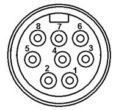
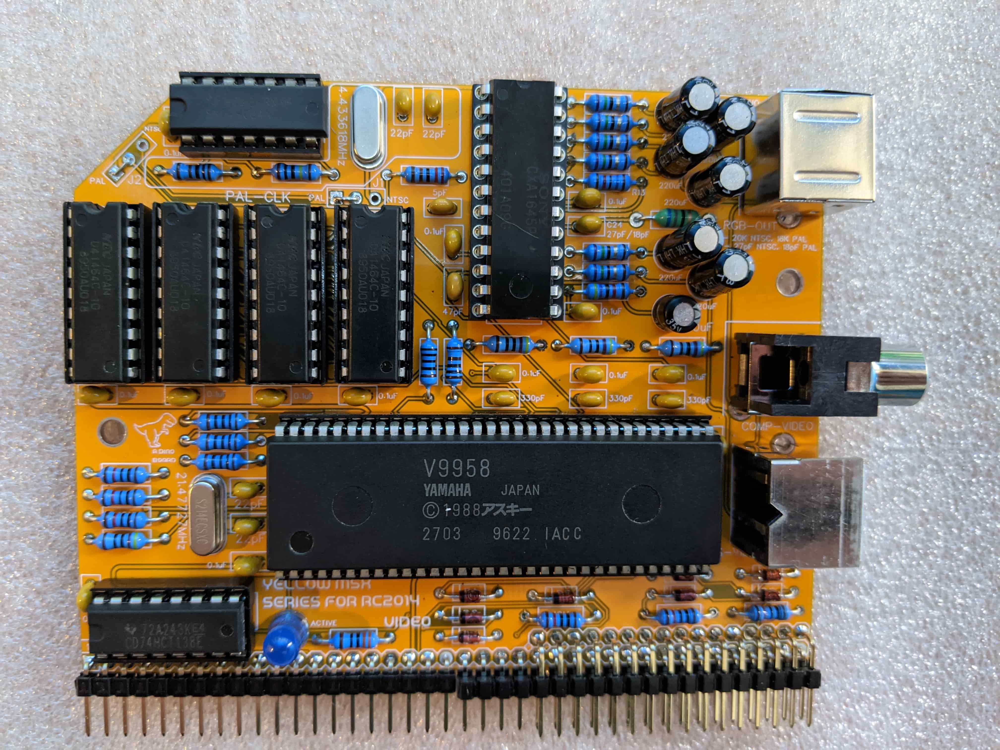

# V9958 Video Board Designed for RC2014

Hackaday Project: https://hackaday.io/project/175574-msx-compatible-boards-for-rc2014

The repo describes the a V9958 video board designed for RC2014 systems.  It is part of planned series of boards,
to provide full MSX2+ compliance.

The design of this board has borrowed a lot from pre-existing solutions out there, including:

* [S100 Computers VDP Project](http://www.s100computers.com/My%20System%20Pages/VDP%20Video%20Board/VDP%20Board.htm)
* [The MTXPlus+ Project](http://primrosebank.net/computers/mtx/projects/mtxplus/video/mtxplus_vdp_design.htm)
* [V9958 Video Board for rosco_m68k](https://github.com/rosco-m68k/hardware-projects/tree/master/video9958)
* [Steckschwein](https://steckschwein.de/hardware/v9958-video-board/)
* [The Artemisa Project](https://github.com/apoloval/artemisa)
* [The Omega MSX Kit](https://github.com/skiselev/omega)

*Standing on the sholders of giants.  Many thanks to all who share their knowledge and passions*

### Highlights:

* Produces RGB, Composite or S-Video output
* Can be built for NTSC or PAL output
* 128K RAM
* TMS9918 backwards compatible

For the PAL version, R13 must be 16K, C14 18pf.
For the NTSC version, R13 must be 20K and C14 27pf.
J1 and J2 are shorted appropriately.

A quick video of it in operation: https://youtu.be/cfbAkXvbp94

## Bill of Materials

|Count   | Name  |  Designator |
|:------:|-------|-------------|
| 1      |  47pF  |  C12
| 14     |   0.1uF |   C16,C9,C7,C5,C25,C1,C30,C28,C31,C15,C6,C14,C13,C10
| 1      |  10uF   | C17
| 6      |  220uF   | C23,C21,C22,C20,C19,C18
| 1      |  27pF/18pF  |  C24
| 4      |  22pF  |  C27,C26,C2,C3
| 1      |  5pF  |  C29
| 3      |  330pF  |  C4,C8,C11
| 8      |  1N4148  |  D1,D8,D2,D3,D4,D5,D6,D7
| 2      |  PAL/NTSC  |  J1,J2
| 1      |  AUDIO-IN  |  J3
| 1      |  68uH   | L1
| 1      |  ACTIVE  |  LED1
| 1      |  RCA SOCKET  |  P1
| 1      |  RGB-OUT  |  P2
| 1      |  S-VIDEO  |  P3
| 6      |  10K  |  R1,R19,R21,R17,R16,R18
| 6      |  75   | R10,R11,R9,R8,R7,R6
| 1      |  330  |  R12
| 1      |  20K/16K |   R13
| 1      |  47K  |  R14
| 2      |  1K   | R15,R5
| 4      |  470  |  R20,R2,R4,R3
| 1      |  2k2  |  R22
| 1      |  1M   | R23
| 4      |  100   | R25,R27,R26,R24
| 1      |  V9958   | U1
| 1      |  74HC138  |  U2
| 1      |  CXA1645P  |  U3
| 1      |  74HC04  |  U4
| 4      |  41464C  |  U6,U7,U8,U5
| 1      |  21.47727MHz  |  X1
| 1      |  4.433618MHz  |  X2
| 1      | Right Angle 20x2 Header | B1
| 1      | Right Angle header 1x20 |B1
| 1      |  14 POS IC SOCKET    |
| 1      |  16 POS IC SOCKET    |
| 4      |  18 POS IC SOCKET    |
| 1      |  24 POS IC SOCKET    |
| 1      |  64 POS IC SOCKET    |

## Sample Apps

In the [apps-rc2014](apps-rc2014) directory you will find the source code for some apps - they can be run under CP/M on a RC2014 system.  The prebuilt binaries can be found in the [bin](bin) directory.

I am also in the process of writing a chip8 interpreter, including the [Octo - https://github.com/JohnEarnest/Octo](https://github.com/JohnEarnest/Octo) extensions.

A short video demonstration of a Octo game running on my RC2014 - https://youtu.be/Io6a7p538Uc

## Output connections

You may want to think about how you plan to connect this board to your chosen monitor.  The video signals produced by 80's hardware is not trivial to connect to modern HDMI LCD monitors.  For such monitors you will need a converter to upscale the output.  Although VGA Monitors can accept a RGB signal, they are unlikely to support the lower frequency of 15Khz produced by this board.

The board produces 3 output types, Composite, S-Video and RGB.  The RGB output is recommended for best results.  The RGB output is provided via an 8 pin mini-din connector.  You will almost certainly need to make up a cable to connect to an RGB monitor or HDMI converter.

I cant recommend any specific converters - there are a few options out there OSSC, retrotink and others.

I have been using an [OSSC](http://junkerhq.net/xrgb/index.php?title=OSSC), that  I purchased fully assembled. It's a bit pricey but it works really well.

I suspect the [Retrotink 2x-scart](https://www.retrotink.com/product-page/retrotink-2x-scart) will work, but as I dont have one, I am unable to verify.

The RGB output of this board provides 4 video signals (Red, Green, Blue and Sync) and  Ground.

For more details I recommend [retrorgb.com](https://www.retrorgb.com/)'s [RGB Guide](https://www.retrorgb.com/rgbguide.html) for all things RGB, Video and conversion.

### RGB mini din pin out

<table>
  <tr>
    <th>Pin</th><th>Signal</th><th/>
  </tr>
  <tr><td>1</td><td>Audio* </td><td rowspan=8></td></tr>
  <tr><td>2</td><td>Audio </td></tr>
  <tr><td>3</td><td>Sync** </td></tr>
  <tr><td>4</td><td>Ground</td></tr>
  <tr><td>5</td><td>NC    </td></tr>
  <tr><td>6</td><td>Blue  </td></tr>
  <tr><td>7</td><td>Green </td></tr>
  <tr><td>8</td><td>Red   </td></tr>

</table>

\* The sync provided is Sync on composite.

\*\* Optional audio pass thru from onboard connector (J3)

## Port Mapping

The board uses the standard IO addresses for MSX systems.

The first 2 ports are identical as per the TMS9918 chip.  The V9938/58 have additional ports to access higher functions.

| Port |	Description|
|------|-------------|
| $98	(r/w) | VRAM data  |
| $99 (w)	| VDP register selection |
| $99 (r)	 | Status register |
| $9A |	Palette access  |
| $9B	| Indirect register access  |

## Programming the chip

Have a look at the sample apps included in this repo [apps-rc2014](apps-rc2014).

For specific details on programming the chip, I recommend:

* [V9938 Programmers Guide](http://rs.gr8bit.ru/Documentation/V9938-programmers-guide.pdf) hosted on (http://www.gr8bit.ru/gr8bit-knowledge-base.html)
* [V9938 Datasheet](datasheets/yamaha_v9938.pdf)
* [V9958 Datasheet](datasheets/yamaha_v9958.pdf)

* Also worth checking out some MSX VDP specific articles at: [http://map.grauw.nl/](http://map.grauw.nl/articles/).

## Resources

* Schematic design for V9958 board designed for RC2014: [schematic.pdf](schematic.pdf "Schematic design for V9958 board designed for RC2014")

## Construction notes

Please note that due to the finer pitch pins of the V9958, the soldering of this board requires a little more finesse than the typical RC2014 through-hole based boards.  If you have built a few boards already, then you should be fine.  It's recommended that a finer pitch soldering tip be used as it can be easy to accidently bridge some of the pins.

Extra care needed when inserting the V9958 into its socket - there are lots of pins, take your time to avoid bending pins.

You need to identify if you plan to build a PAL or NTSC version and select the correct resistor and capacitors for R13 and C14.

## License
Copyright 2021 Dean Netherton

Permission is hereby granted, free of charge, to any person obtaining a copy of this software and associated documentation files (the "Software"), to deal in the Software without restriction, including without limitation the rights to use, copy, modify, merge, publish, distribute, sublicense, and/or sell copies of the Software, and to permit persons to whom the Software is furnished to do so, subject to the following conditions:

The above copyright notice and this permission notice shall be included in all copies or substantial portions of the Software.

THE SOFTWARE IS PROVIDED "AS IS", WITHOUT WARRANTY OF ANY KIND, EXPRESS OR IMPLIED, INCLUDING BUT NOT LIMITED TO THE WARRANTIES OF MERCHANTABILITY, FITNESS FOR A PARTICULAR PURPOSE AND NONINFRINGEMENT. IN NO EVENT SHALL THE AUTHORS OR COPYRIGHT HOLDERS BE LIABLE FOR ANY CLAIM, DAMAGES OR OTHER LIABILITY, WHETHER IN AN ACTION OF CONTRACT, TORT OR OTHERWISE, ARISING FROM, OUT OF OR IN CONNECTION WITH THE SOFTWARE OR THE USE OR OTHER DEALINGS IN THE SOFTWARE.

