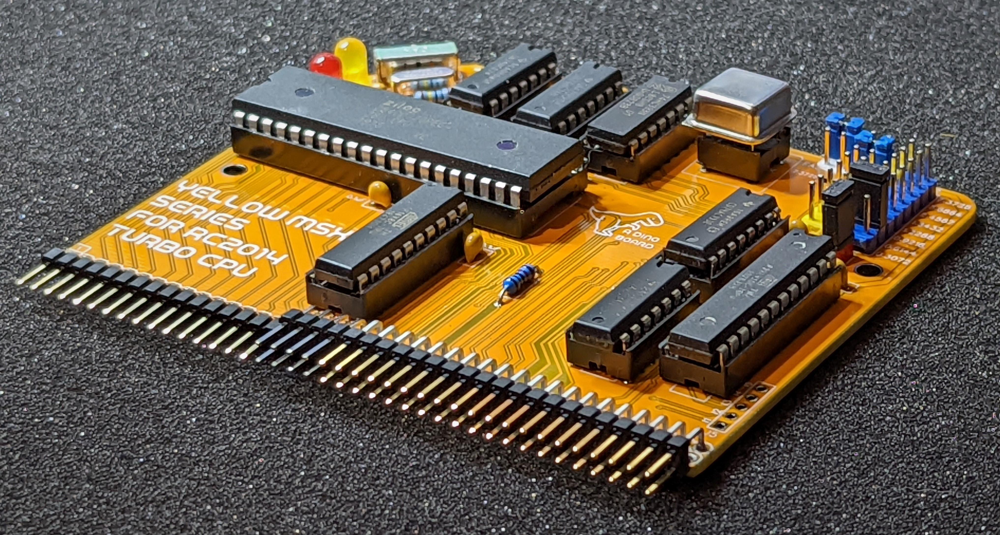
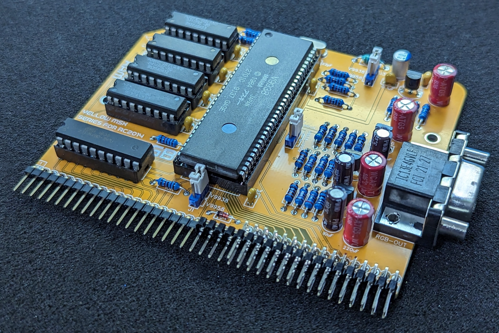
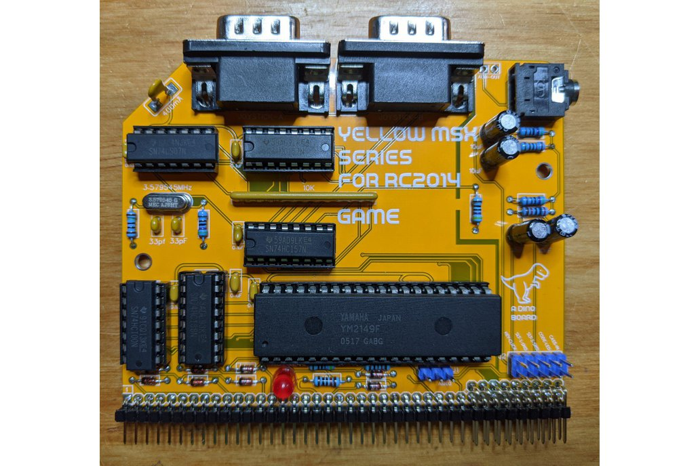
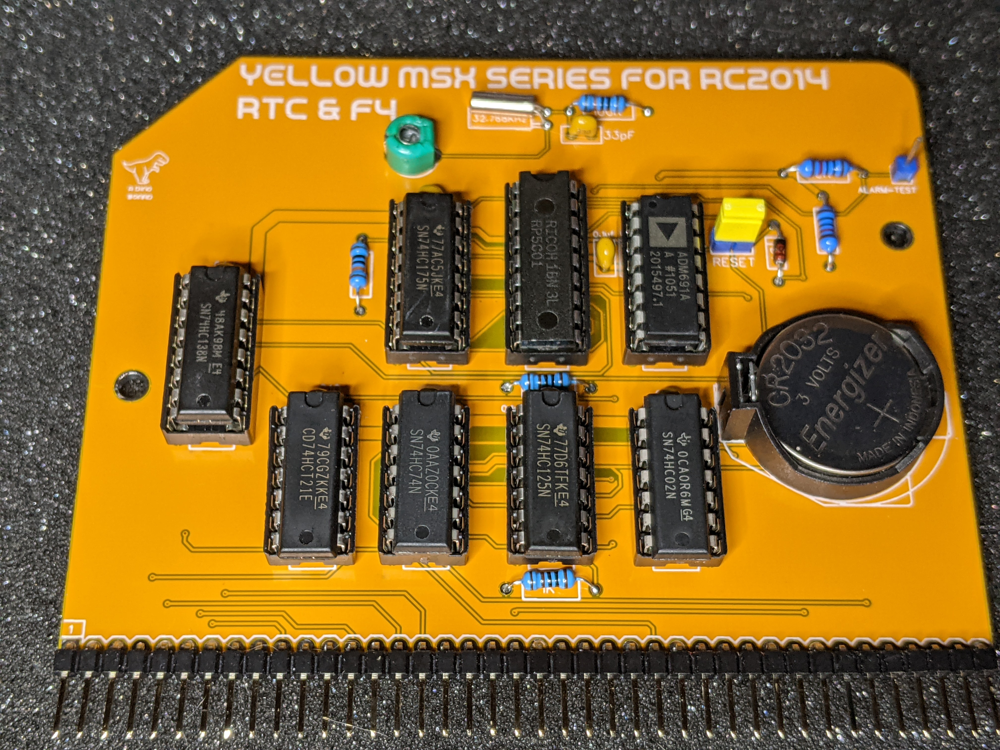

# Yellow MSX Series for RC2014

[](https://circleci.com/gh/vipoo/yellow-msx-series-for-rc2014/tree/dev)

Hackaday Project: [msx-compatible-boards-for-rc2014](https://hackaday.io/project/175574-msx-compatible-boards-for-rc2014)


</br>

The repo describes a series of boards designed to be compatible with the RC2014 bus.  Once the minimum set of boards are assembled, you will have your very own MSX+ compatible computer -- built by you!

The idea is that you can build each board one at a time, test it and play with it under RomWBW - and then once you have the set - load up some MSX/MSX2+ games!

The story of the prototyping and development these boards can be found at the Hackaday Project: [msx-compatible-boards-for-rc2014](https://hackaday.io/project/175574-msx-compatible-boards-for-rc2014) project page.

## Summary of all kits

### MSX Cassette + USB Module 

<table><tr><td  >
<a href="https://www.tindie.com/products/edit/msx-cassette-usb-module-designed-for-rc2014"></a>
</td>
<td width="90%">

Kit available at the dinotron store on [Tindie](https://www.tindie.com/products/dinotron/msx-cassette-usb-module-designed-for-rc2014/)

See the [README file here](./cassette-and-usb/README.md)


</td></tr></table>

<hr/>

### 12+1 Backplane

<table><tr><td  >
<a href="https://www.tindie.com/products/dinotron/121-backplane-designed-for-rc2014-systems/"></a>
</td>
<td width="80%">

See the [README file here](./backplane/readme.md)

Kit available at the dinotron store on [Tindie](https://www.tindie.com/products/dinotron/121-backplane-designed-for-rc2014-systems)

</td></tr></table>

<hr/>

### Turbo CPU

<table><tr><td  >
<a href="https://www.tindie.com/products/dinotron/turbo-cpu-module-designed-for-rc2014/"></a>
</td>
<td width="90%">

See the [README file here](./turbo-cpu/readme.md)

Kit available at the dinotron store on [Tindie](https://www.tindie.com/products/dinotron/turbo-cpu-module-designed-for-rc2014)

</td></tr></table>

<hr/>

### MSX Memory Module

<table><tr><td  >
<a href="https://www.tindie.com/products/dinotron/msx-memory-board-for-rc2014/"></a>
</td>
<td width="90%">

See the [README file here](./memory/README.md)

Kit available at the dinotron store on [Tindie](https://www.tindie.com/products/dinotron/msx-memory-board-for-rc2014)

</td></tr></table>

<hr/>

### V99x8 MSX Video Module

<table><tr><td  >
<a href="https://www.tindie.com/products/dinotron/v99x8-msx-rgb-video-module-for-rc2014/"></a>
</td>
<td width="90%">

See the [README file here](./video/README-RGB.md)

Kit available at the dinotron store on [Tindie](https://www.tindie.com/products/dinotron/v99x8-msx-rgb-video-module-for-rc2014/)
</td>
<tr>
</table>

<hr/>

### YM2149 Game Module

<table><tr><td  >
<a href="https://www.tindie.com/products/dinotron/ym2149-msx-game-board-for-rc2014/"></a>
</td>
<td width="90%">

See the [README file here](./game/README.md)

Kit available at the dinotron store on [Tindie](https://www.tindie.com/products/dinotron/ym2149-msx-game-board-for-rc2014)

</td></tr></table>

<hr/>

### Real-Time-Clock Module

<table><tr><td  >
<a href="https://www.tindie.com/products/dinotron/msx-rp5c01-rtc-and-msx-f4-board-for-rc2014/"></a>
</td>
<td width="90%">

See the [README file here](./rtc/README.md)

Kit available at the dinotron store on [Tindie](https://www.tindie.com/products/dinotron/msx-rp5c01-rtc-and-msx-f4-board-for-rc2014)

</td></tr></table>

<hr/>

### PPI Module & Keyboard

<table><tr><td  >
<a href="https://www.tindie.com/products/dinotron/msx-keyboard-designed-for-rc2014/"></a>
</td>
<td width="90%">

Kit available at the dinotron store on [Tindie](https://www.tindie.com/products/dinotron/msx-keyboard-designed-for-rc2014)

See the [PPI README file here](./ppi/README.md)

See the [Keyboard README file here](./keyboard/README.md)

A set of compatible switches available here [Switches](https://www.tindie.com/products/dinotron/switches-and-stabilizers-for-msx-rc2014-keyboard/)

A set of compatible caps available here [Caps](https://www.tindie.com/products/dinotron/keycap-set-for-msx-rc2014-keyboard/)

</td></tr></table>

<hr/>

### YM2413 MSX-Music Module

<table><tr><td  >
<a href="https://www.tindie.com/products/dinotron/ym2413-msx-music-module-designed-for-rc2014/"></a>
</td>
<td width="90%">

See the [README file here](./music/README.md)

Kit available at the dinotron store on [Tindie](https://www.tindie.com/products/dinotron/ym2413-msx-music-module-designed-for-rc2014)

</td></tr></table>

<hr/>

### MSX Cartridge Slot Extension for the 12+1 Backplane

<table><tr><td  >
<a href="https://www.tindie.com/products/dinotron/msx-cartridge-slot-extension-for-rc2014-bus/"></a>
</td>
<td width="90%">

See the [README file here](./slot-extension/readme.md)

Kit available at the dinotron store on [Tindie](https://www.tindie.com/products/dinotron/msx-cartridge-slot-extension-for-rc2014-bus)

</td></tr></table>

<hr/>


## Configuration and Software Notes

Click thru for more information on:

**[RomWBW Apps](./readme-romwbw-apps.md) specific instructions**

**[Compatibility with RC2014 Configuration](./readme-romwbw-compatibility.md)**

**[General MSX documents](./msx/docs/index.md)**

**[Details of compiling and assembling code](./msx/README.md) MSX applications and bios images**

#### Integrating the ESP8266 Wifi Module

Click [here](./wifi/README.md) for instructions on integrating the stock RC2014 ESP8266 wifi module into your MSX build.

Kits are available from the official RC2014 stores at [z80Kits](https://z80kits.com/shop/esp8266-wifi-module) and [Tindie](https://www.tindie.com/products/semachthemonkey/esp8266-wifi-module-for-rc2014/)


## Cloning this repo

This repo contains submodules.  So to clone the repo's submodules, you may need to do the following:

`git clone --recursive git@github.com:vipoo/yellow-msx-series-for-rc2014.git`

If you had already cloned it, without the `--recursive` switch:

`git submodule update --init`

> If using Windows Subsystem for Linux, make sure you are using the linux file system (not the mnt/c/... ntfs images)

**Please note: github submodule configuration assumes you are using ssh to access the repos**

If you get a permission denied error when attempting to clone the submodules, it may be due to your github access method.  The submodules are referenced using git ssh paths (eg:  git@github.com:vipoo/Nextor.git), as such if you attempt to clone these submodules using only https access, you may get a permission denied error.

To setup github access using ssl - follow the instruction on github at: https://docs.github.com/en/github/authenticating-to-github/connecting-to-github-with-ssh

### Force use of https://... git paths

Alternatively, if you wish to clone using the https path, you may find running this command first before cloning the submodule will help:

```
git config --global url."https://github.com/".insteadOf git@github.com:
```

## Acknowledgements

The design of the boards has borrowed a lot from pre-existing solutions out there, including:

* [S100 Computers VDP Project](http://www.s100computers.com/My%20System%20Pages/VDP%20Video%20Board/VDP%20Board.htm)
* [The MTXPlus+ Project](http://primrosebank.net/computers/mtx/projects/mtxplus/video/mtxplus_vdp_design.htm)
* [V9958 Video Board for rosco_m68k](https://github.com/rosco-m68k/hardware-projects/tree/master/video9958)
* [Steckschwein](https://steckschwein.de/hardware/v9958-video-board/)
* [The Artemisa Project](https://github.com/apoloval/artemisa)
* [Omega Home Computer Project](https://github.com/skiselev/omega)
* [MSX ORG Forums](https://www.msx.org/)

*Standing on the shoulders of giants.  Many thanks to all who share their knowledge and passions*

## Disclaimer

My little kits described here are not authorised or associated in anyway with the rightful owners of the MSX trademark/platform.  These kits are designed to be MSX compatible.  There is nothing 'official' here.

And my thanks to all the pioneers and developers of this platform - An inspiring platform that continues to enable also sorts of creativity and joy for myself and many others.

## License
Copyright 2021 Dean Netherton

Permission is hereby granted, free of charge, to any person obtaining a copy of this software and associated documentation files (the "Software"), to deal in the Software without restriction, including without limitation the rights to use, copy, modify, merge, publish, distribute, sublicense, and/or sell copies of the Software, and to permit persons to whom the Software is furnished to do so, subject to the following conditions:

The above copyright notice and this permission notice shall be included in all copies or substantial portions of the Software.

THE SOFTWARE IS PROVIDED "AS IS", WITHOUT WARRANTY OF ANY KIND, EXPRESS OR IMPLIED, INCLUDING BUT NOT LIMITED TO THE WARRANTIES OF MERCHANTABILITY, FITNESS FOR A PARTICULAR PURPOSE AND NONINFRINGEMENT. IN NO EVENT SHALL THE AUTHORS OR COPYRIGHT HOLDERS BE LIABLE FOR ANY CLAIM, DAMAGES OR OTHER LIABILITY, WHETHER IN AN ACTION OF CONTRACT, TORT OR OTHERWISE, ARISING FROM, OUT OF OR IN CONNECTION WITH THE SOFTWARE OR THE USE OR OTHER DEALINGS IN THE SOFTWARE.

