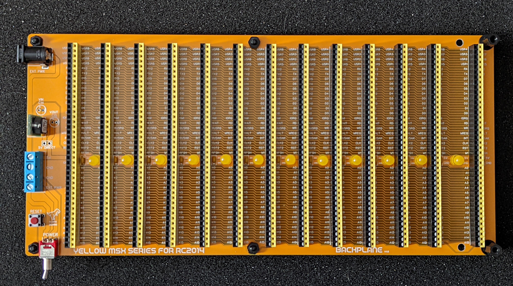
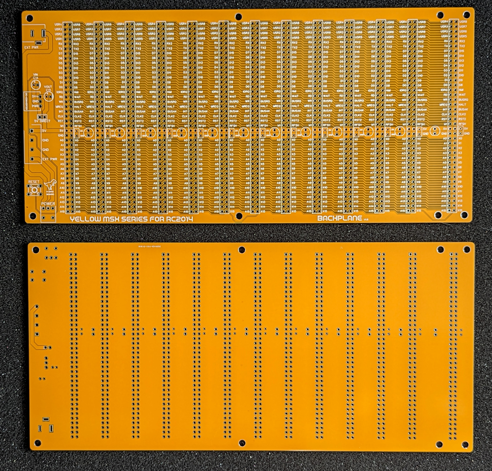
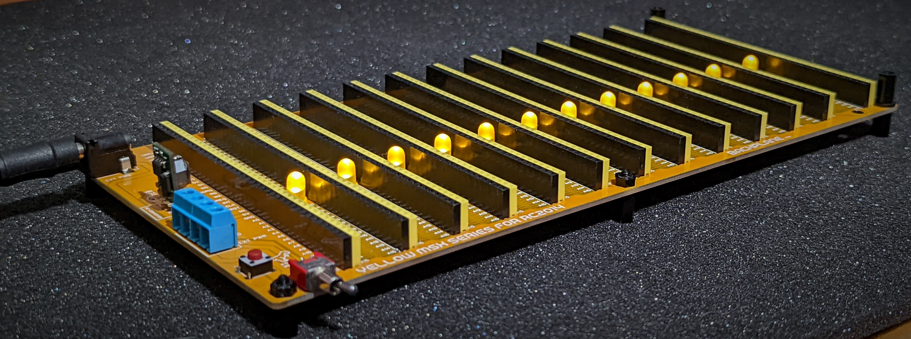
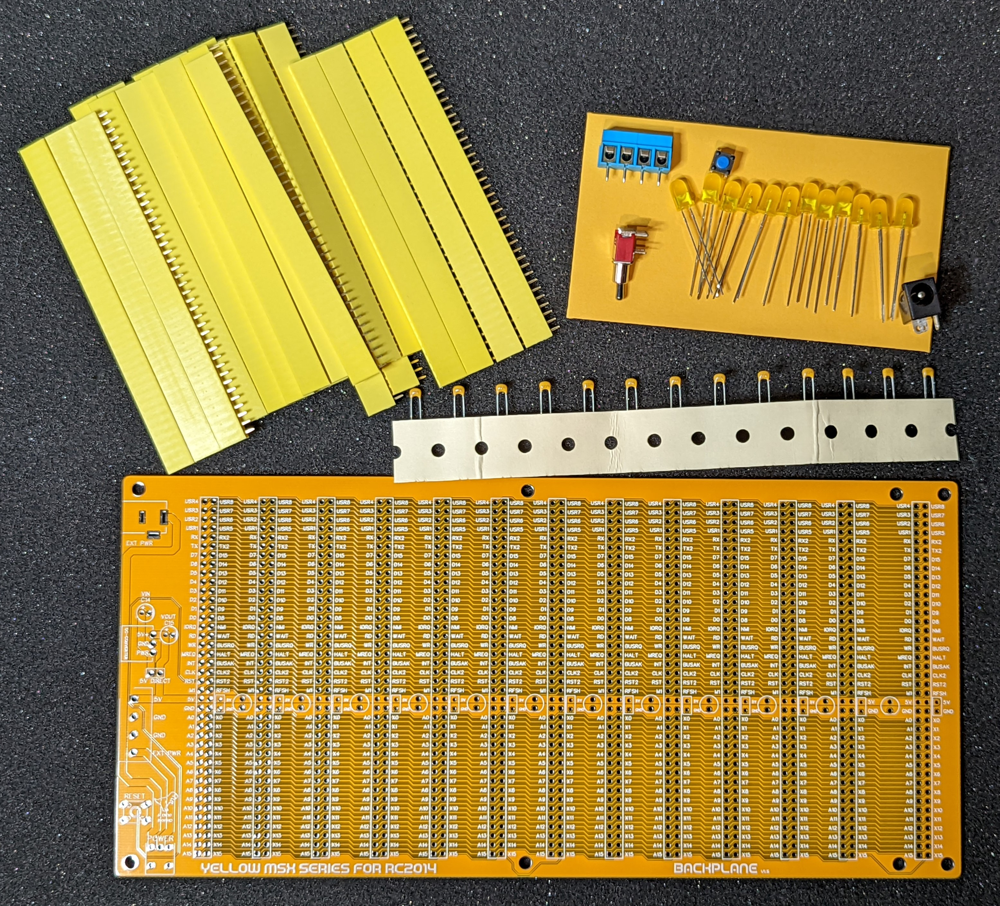
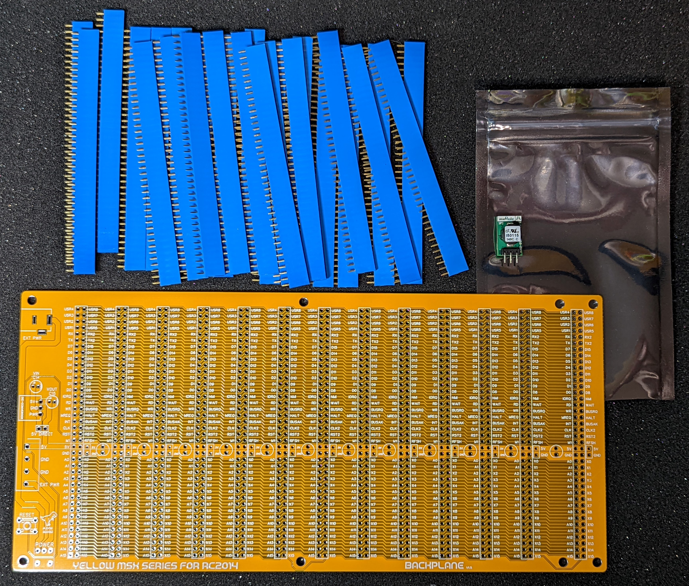

## Hackaday Project:

* [msx-compatible-boards-for-rc2014](https://hackaday.io/project/175574-msx-compatible-boards-for-rc2014)
* [With Cartridge Extension Board](https://hackaday.io/project/175574-msx-compatible-boards-for-rc2014/log/199897-backplane-and-cartridge-extension)

## Title

12+1 Backplane designed for RC2014 systems

## Brief Description

A Backplane for RC2014 systems, with 80 lanes, ideal for MSX configuration.

### What is it?

A 13 slot backplane for [RC2014](https://rc2014.co.uk/) compatible modules, well suited for the full complement of Yellow MSX Series of Modules designed for [RC2014](https://rc2014.co.uk/).

Primarily focused on the needs for supporting the full set of MSX modules, the 12+1 Backplane, with its 80 lanes and 13 slots, will meet the needs of any large [RC2014](https://rc2014.co.uk/) configurations.

And the 12 on-board yellow power LEDs will quite literally make your RC2014 system glow!

The 13th slot is offset slightly from the rest of the slots, to allow for connecting the MSX Cartridge slot extension***

## Full MSX build:

1. RC2014 CPU Module
2. RC2014 Clock Module
3. RC2014 SIO/2 Module
4. RC2014 Compact Flash Module
5. RC2014 Wifi Module
6. Yellow MSX Series Memory Module designed for RC2014
7. Yellow MSX Series Video Module designed for RC2014
8. Yellow MSX Series Game Module designed for RC2014
9. Yellow MSX Series RTC Module designed for RC2014
10. Yellow MSX Series Keyboard/PPI Module designed for RC2014

### Key features

* 13 RC2014 enhanced compatible slots
* 13th slot offset an extra 1cm for future extension of the MSX Cartridge module
* 80 Lanes
* An optional on-board 5V DC converter
* Reset tactile switch
* 4 way power terminal block for easy extension or alternative powering
* Optional direct 5V in via DC barrel connector
* 12 5V LEDs between each slot 
* 8 3.4mm Mounting holes for M3 fitting

Please note that mounting stand-offs are not supplied.

### What is the 'Yellow MSX Series of Boards'?

These are a series of boards developed to achieve MSX compatibility for [RC2014](https://rc2014.co.uk/) systems.

The idea is that you can build each board one at a time, test it and play with it under RomWBW - and then once you have the set - load up some MSX games!

This backplane kit will give you the perfect foundation for the RC2014 system. 

More details of the development of the Yellow MSX series of modules can be found on my [hackaday project](https://hackaday.io/project/175574-msx-compatible-boards-for-rc2014)

And for RC2014 details, check out its official site https://rc2014.co.uk/

## Bill of Materials

|Count   | Name                    |
|:------:|-------------------------|
| 26     | 40 Way SIL Socket*       |
| 12     | 5V Leds                 |
| 13     | 0.1uF ceramic capacitors |
| 1      | 2.1mm Power Jack        |
| 1      | Tactile Switch          |
| 1      | Toggle Switch           |
| 1      | 4 Way Screw Terminal    |
| 1      | Optional DC Converter **          |

\* different colours available

\*\* pcb footprint is 7805 compatible - a non-isolated switching regulator DC converter can be optionally included [muRata OKI-78SR-5/1.5-W36-C](https://www.murata.com/products/productdata/8807037992990/oki-78sr.pdf)  *(7-36V to 5V @ upto 1.5 amps)*

## Disclaimer

Please note that this is a kit, produced by a non-professional (me) for hackers, DIYers' and retro lovers, to tinker with. I will do my best to answer any support questions you may have.

## Images

Assembled
---------

Top & Bottom
---------

Profile
---------

Basic Kit
---------

Kit Options
---------

## Resources

* Schematic: [schematic.pdf](./schematic.pdf "Schematic")

