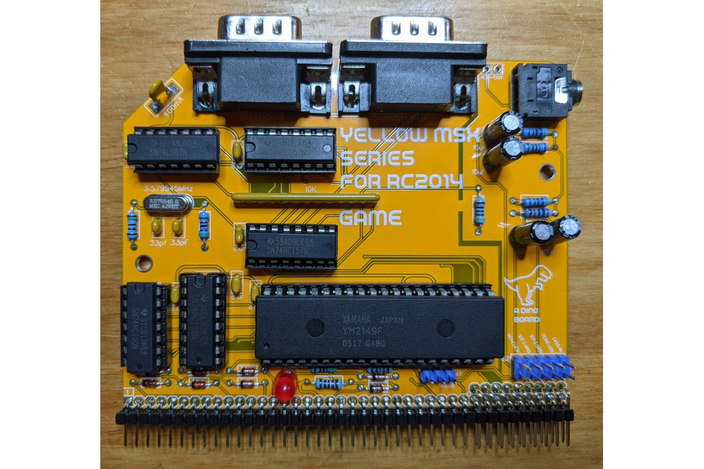
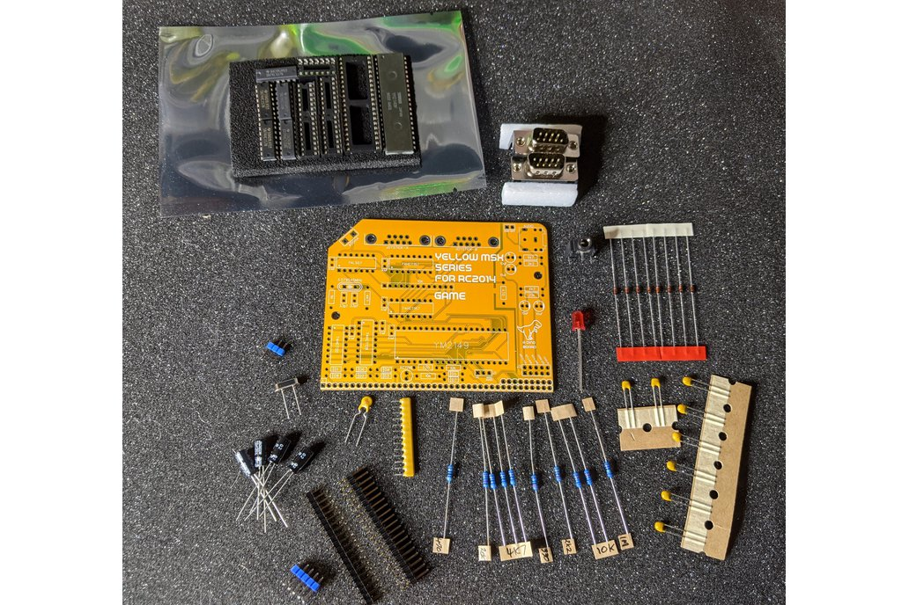
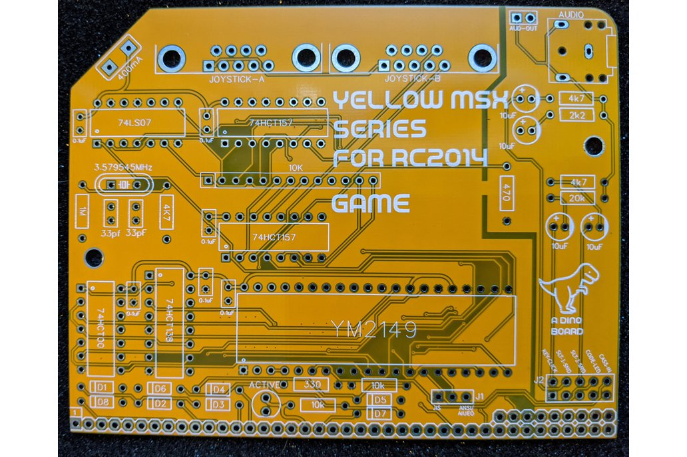
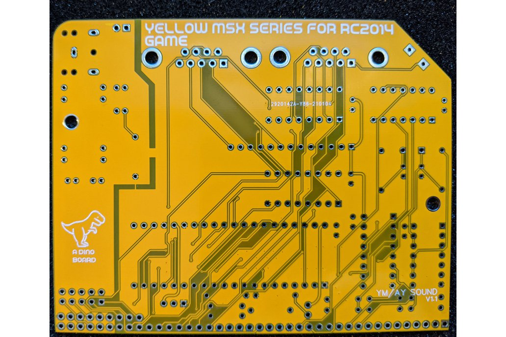

# YM2149 GAME Board Designed for RC2014

Hackaday Project: [msx-compatible-boards-for-rc2014](https://hackaday.io/project/175574-msx-compatible-boards-for-rc2014)

The YM2149 sound and controller board, designed for RC2014 systems, is part of planned series of boards, to provide full MSX2+ compliance.

Highlights:
* YM2149 PSG - 3 channel audio, +1 noise channel
* 2 Controller Inputs (joystick, game-pad, and other input types) - MSX compatible
* optional additional audio input lines, for mixing into the audio out.

A video of it in operation with the V9958 Video board at: https://youtu.be/dUCEZpBlxgY

## Bill of Materials

|Count   | Name  |  Designator |
|:------:|-------|-------------|
| 4      |	10uF |	C10,C13,C12,C11
| 6      |	0.1uF	| C3,C8,C1,C5,C4,C2
| 2      |	33pF	| C7,C6
| 8      |	1N4148	| D8,D5,D7,D6,D4,D3,D2,D1
| 1      |	400mA Fuse |	F1
| 1      |	AUD-OUT	| H1
| 1      |	KYB-TYPE	| J1
| 1      |	BUS-MAP	| J2
| 1      |	JOYSTICK-A |	JY1
| 1      |	JOYSTICK-B |	JY2
| 1      |	ACTIVE |	LED1
| 1      |	3.5 Audio Socket	| P1
| 1      |	10k Ω Bussed x 12	| R1
| 3      |	4k7 Ω	| R10,R11,R4
| 2      |	10k Ω	| R2,R12
| 1      |	470 Ω	| R3
| 1      |	1M Ω	| R5
| 1      |	330 Ω	| R6
| 1      |	2k2 Ω	| R7
| 1      |	20k Ω	| R9
| 1      |	74HCT138 |	U1
| 1      |	YM2149	| U2
| 1      |	74HC00	| U3
| 1      |	74LS07	| U4
| 2      |	74HCT157 |	U6,U5
| 1      |	3.579545MHz |	X1
| 1      |	Right Angle 20x2 Header	| B1
| 1      |	Right Angle header 1x20	| B1
| 2      |	14 POS IC SOCKET |
| 3      |	16 POS IC SOCKET |
| 1      |	40 POS IC SOCKET |

## Sample Apps

The tune.com cp/m distributed with RomWBW works just find with the board - as it has the standard MSX ports.

## Port Mapping

Standard MSX port mapping.

| Port |  range	| Description
|:------:|-------|-------------|
| #A0  | (write)| Register write port
| #A1  | (write)|	Value write port
| #A2  | (read)	| Value read port

The following table describes the registers of the PSG:

| Register(s)	| Description |
|:------:|-------|
| 0-5	| Tone generator control |
| 6	| Noise generator control |
| 7	| Mixer control-I/O enable. Important note: bit 6 must be 0, and bit 7 must be 1.  |
| 8-10	| Amplitude control |
| 11-13	| Envelope generator control |
| 14-15	| I/O ports A & B |

## Images

Assembled
---------

Kit
---------

PCB Front
---------

PCB Back
---------

Installed
---------

## Resources

* Schematic: [schematic.pdf](./schematic.pdf "Schematic")
* [YM2149 Datasheet](../datasheets/ym2149.pdf)
