# MSX Keyboard for RC2014

Hackaday Project: [msx-compatible-boards-for-rc2014](https://hackaday.io/project/175574-msx-compatible-boards-for-rc2014)

The MSX keyboard, is a full size MSX compatible keyboard design for RC2014 system with the PPI interface board

The keyboard connects to the PPI, via a 16 way IDC connection.

Key Features:

* Unambiguous key detection (diodes associated with every switch)
* Power, caps-lock, and code indicator LEDs
* Cherry 5 pin switches
* 73 keys

> Please note that this keyboard requires the PPI board for operation

## Bill of Materials

|Count   | Name                |  Designator |
|:------:|---------------------|-------------|
| 2	     | 0.1uF               | C1,C2 |
| 81     | 1N4148	             | D1-D81 |
| 3      | 3mm LEDS            |
| 1      | IDC Socket          | P1 |
| 3      | 470 Ω               | R2,R3,R1 |
| 1      | 10k Ω x 8           | R4 |
| 73     | switches            | SW1-SW73 |
| 2      | 74HC138             | U2,U1 |
| 4	     | 2U key stabliser    |
| 1      | 6.25U key stabliser |
| 1	     | keycaps set         |
| 1	     | PCB                 |

## Sample Apps

The msxkeyb.com application can be used to test the keyboard matrix lines are working correctly.

## Using keyboard on RomWBW

Although the keyboard and PPI board are designed to work under MSX software, it can be used in a stock RC2014 build.

You can write your own software to interface to the keyboard (see the demo app msxkeyb), or you can activate the
custom driver written for RomWBW's HBIOS.  The drivers code is on my fork of [RomWBW](https://github.com/vipoo/RomWBW/tree/yellow-msx-boards).

## Assembly Notes

My personal recommendation is solder all the passive components first, then the sockets and IDC connector.

You will certainly want to solder the diodes on the keyboard before doing the switches.

Mount the switches last -- you should get a satisfying click as you push the switch into the board - but be careful that both pins have come thru cleanly.  The pins are fairly thin and easy for them not to align and to be bent.

Start with just one or two switches first -- push in, then check pins, then solder.  Move onto a next set of switches.  Once you are more comfortable, go for bigger batches - just keep on eye on the pins.

Once all the soldering is done, you can move onto mounting the stabilizers.

## Assembling the stabilizers

To assemble the stabilizers, you can use the following images to get an idea of how they go together.

Line up the housing and insert as shown.  Note the orientation of the items.

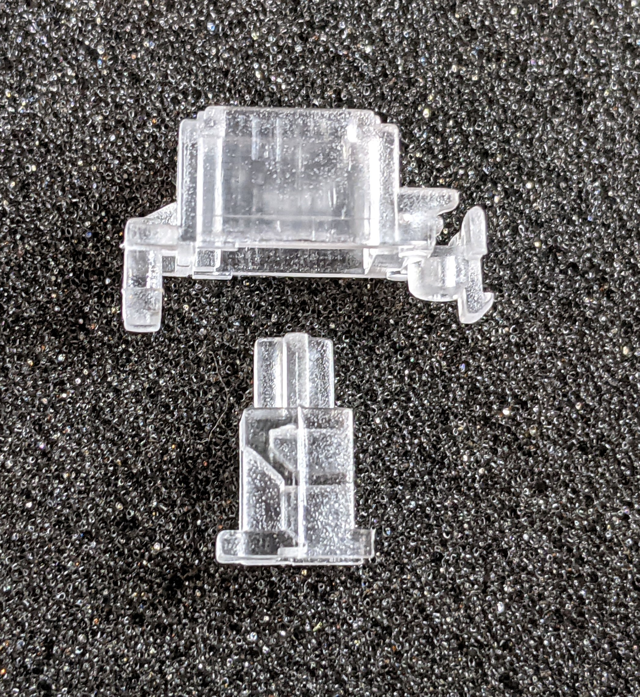

 

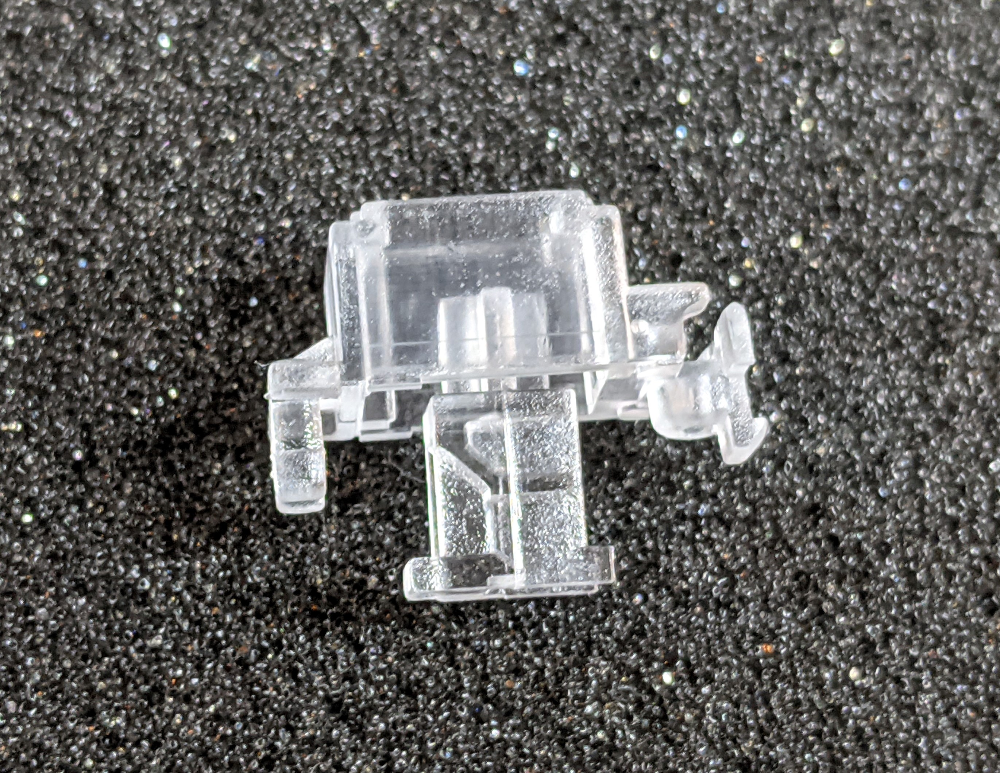

 

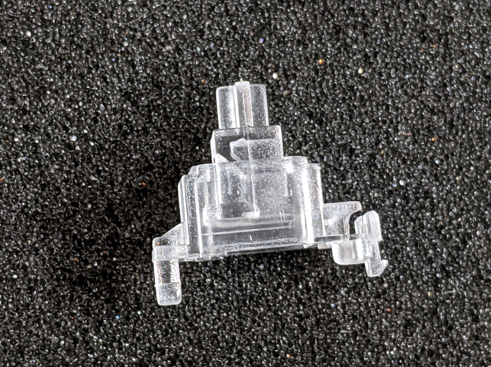
 

Next, insert the bar as shown:

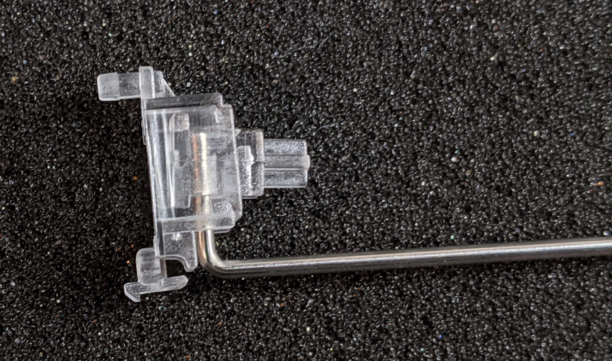

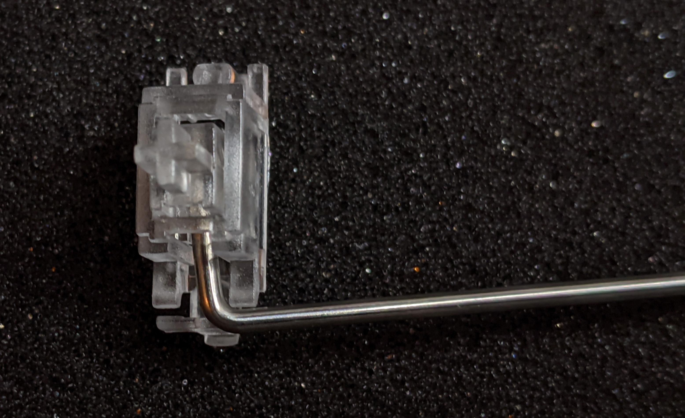

And finally, carefully clip the bar into the mounting as shown:

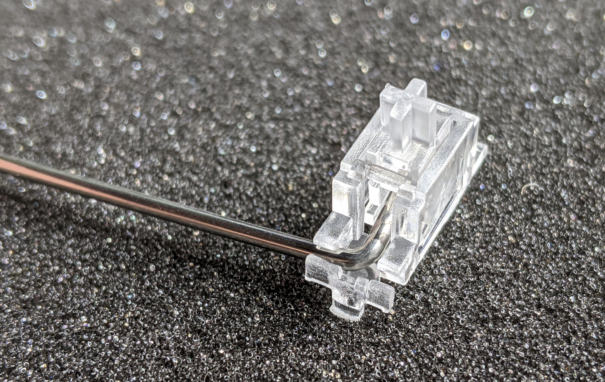

The insert should be able to move up and down as the bar is rotated.

Repeat for the other side of the bar and for the rest of the stabilizers.

Once the stabilizers are assembled, you can now mount them on the PCB as shown below:

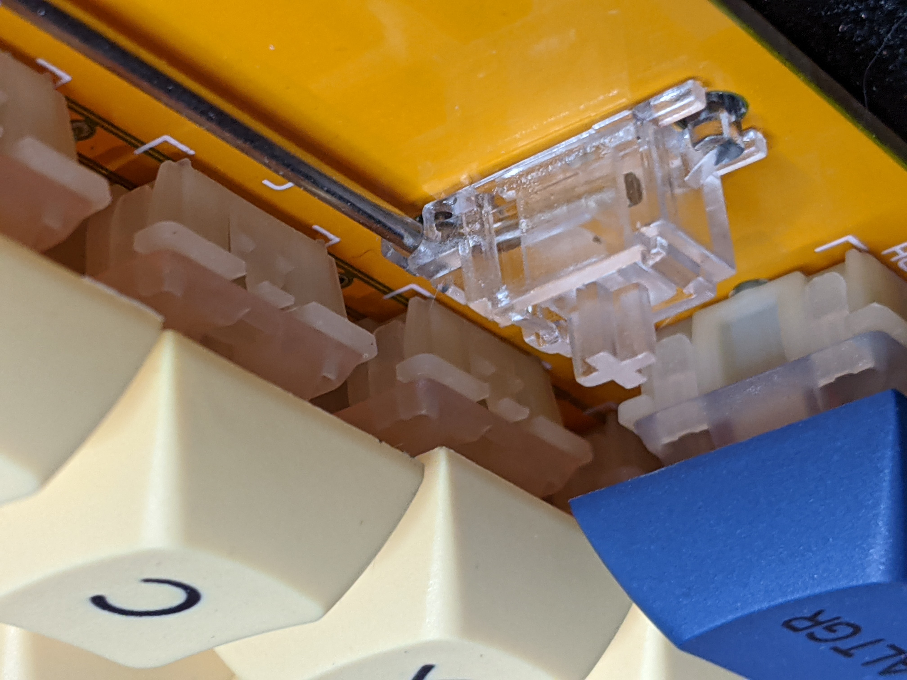

The insert should be able to be moved up and down freely within the housing.

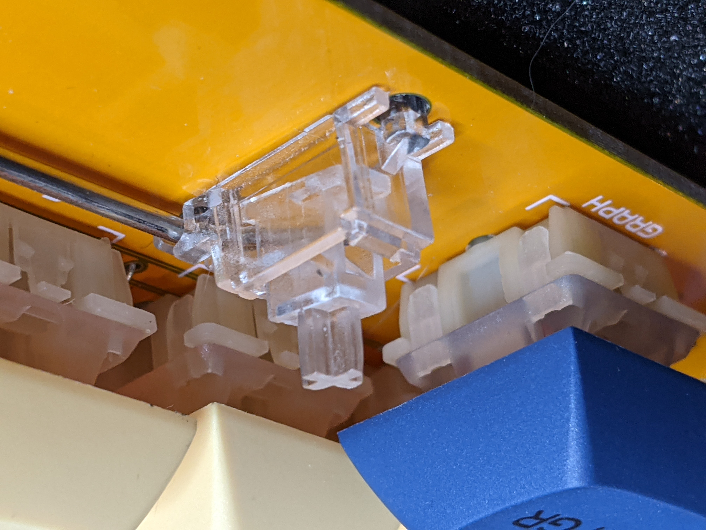

The following images show the space bar and other stabilizers mounted onto the PCB

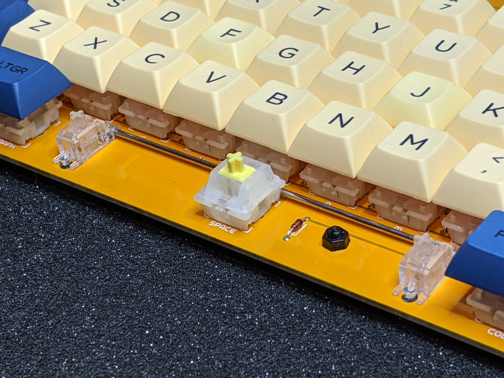&nbsp;&nbsp;&nbsp;&nbsp;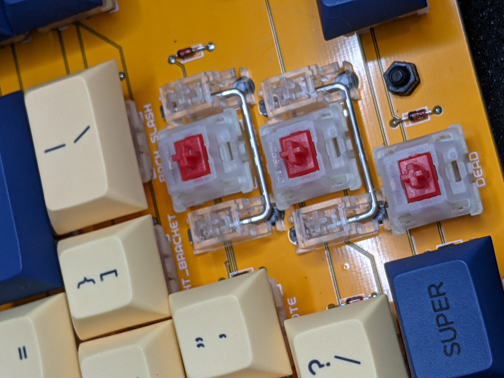
 

 

## Fully Assembled

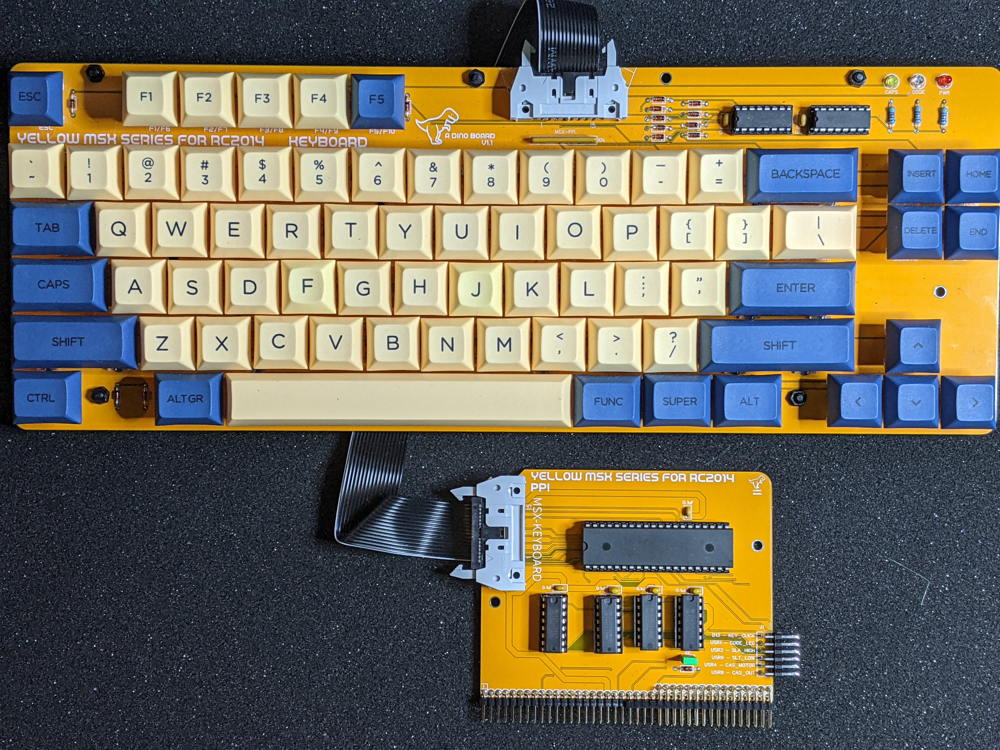

(with V1.6 of PPI)

## PCB
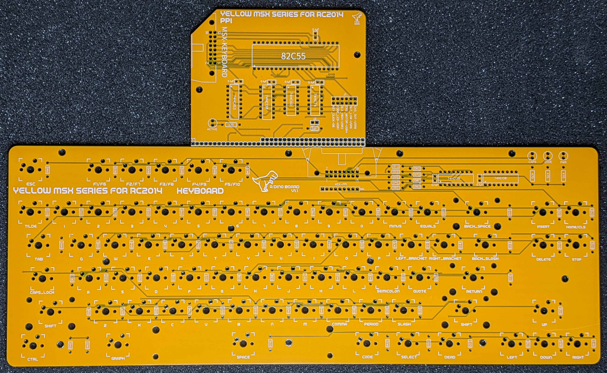

(with V1.4 of PPI)

## Resources

* Schematic: [schematic.pdf](./schematic.pdf "Schematic")

## Other references

* [Keyboard matrices - Grauw](http://map.grauw.nl/articles/keymatrix.php)
* [MSX ORG PPI Page](https://www.msx.org/wiki/Programmable_Peripheral_Interface)
* [MSX Red Book](https://github.com/gseidler/The-MSX-Red-Book/blob/master/the_msx_red_book.md)
