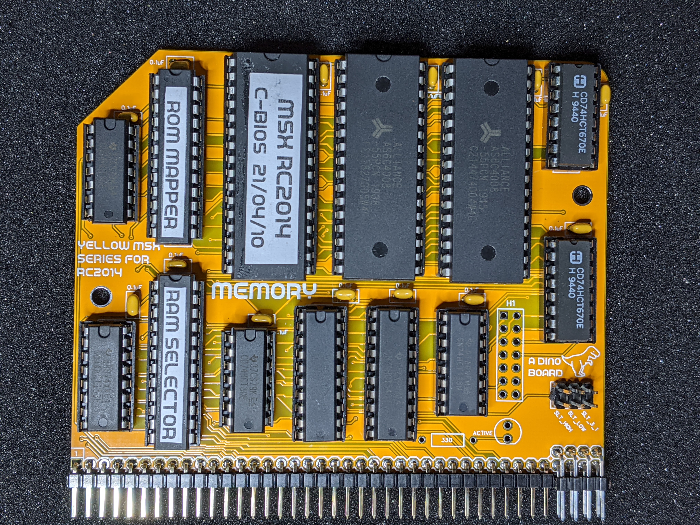
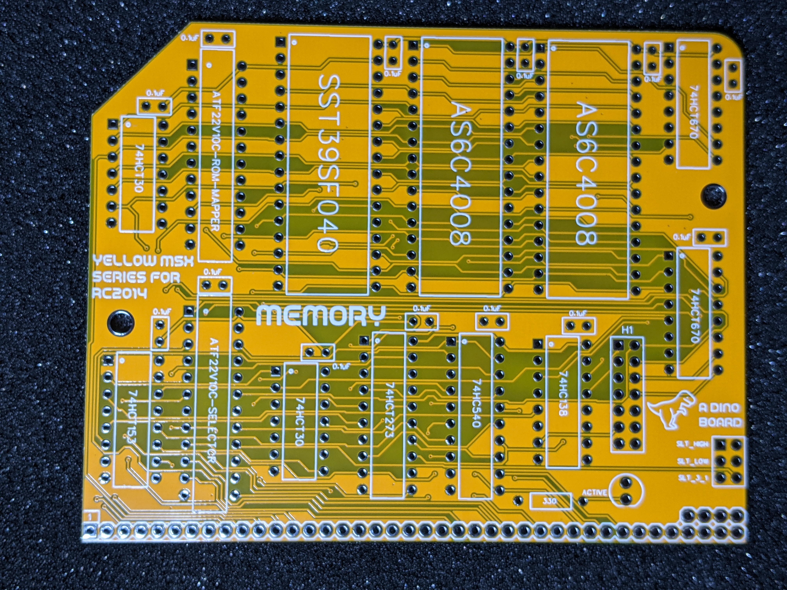
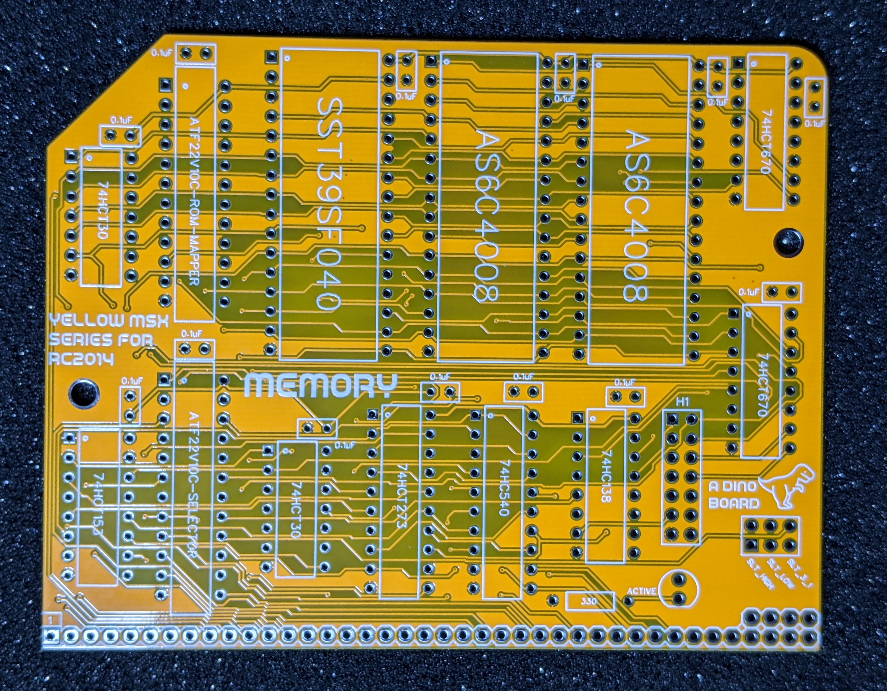
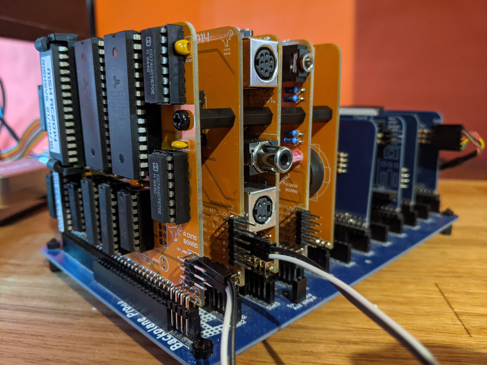
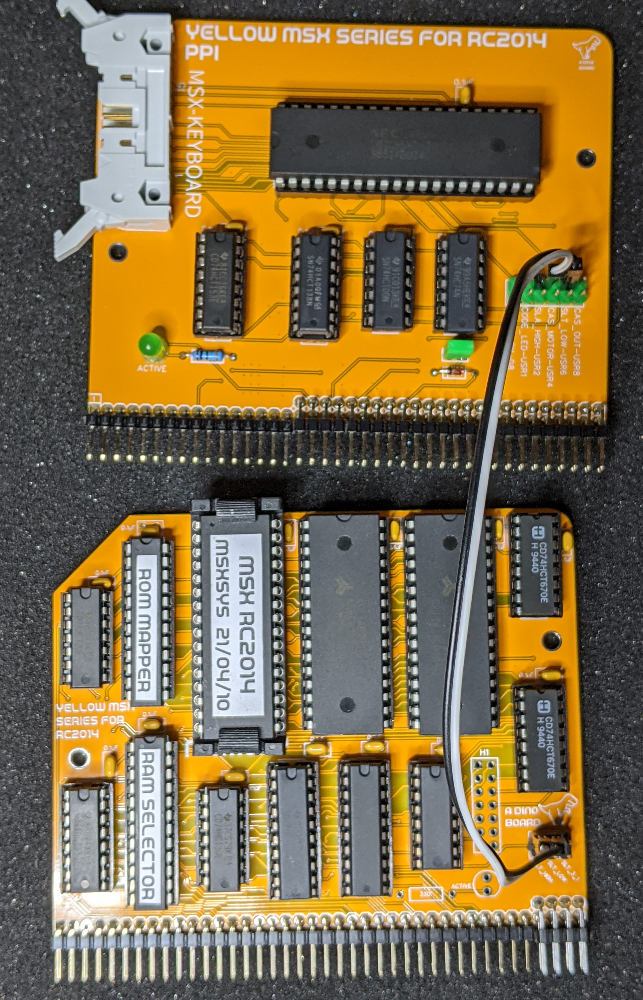

# MSX Memory Board for RC2014

Hackaday Project: [msx-compatible-boards-for-rc2014](https://hackaday.io/project/175574-msx-compatible-boards-for-rc2014)

<a href="https://www.tindie.com/products/dinotron/msx-memory-board-for-rc2014"></a>

## Description

This is a kit, that once built and installed on your RC2014 platform along side the other MSX modules, will allow you to boot up MSX software on your RC2014.

The onboard 512K ROM is mapped according to the MSX Architecture, so that the RC2014 can be booted with an MSX BIOS and MSX-DOS ROM image.

The ROM is paged into the Z80's address space, allowing the banking of MSX BIOS, MSX BIOS SUB-ROM, MSX BIOS LOGO BOOT along with a banked MSX-DOS/NEXTOR kernel and disk drivers for RC2014 operation.

The ROM is devided into 16K banks, mapped at the following addresses and MSX slots:

|  SLOT  |  CPU ADDRESS      |  DESC                    |  ROM CHIP'S ADDR    |
|--------|-------------------|--------------------------|---------------------|
|    0   | 0x0000 to 0x7FFF  | MAIN ROM (48K)           | 0x00000 to 0x07FFF  |
|    0   | 0x8000 to 0xBFFF  | LOGO ROM (16K)           | 0x08000 to 0x0BFFF  |
|  3-0   | 0x0000 to 0x3FFF  | SUB ROM (16K)            | 0x0C000 to 0x0FFFF  |
|  3-3   | 0x4000 to 0x7FFF  | MSX-DOS/NEXTOR/ROM DISK  | 0x10000 to 0x7FFFF  |

The first 64K of the onboard ROM is coded to be addressed from slot 0 and 3-0.
The remaining 28 16K banks mapped to slot 3-3, using the [ASCII16](https://www.msx.org/wiki/MegaROM_Mappers#ASC16_.28ASCII.29) banking system.

The banking configuration for the ROM is controlled thru a PLD (ATF22V10C), and can be reprogrammed to reconfigured the banking addressing, if so desired.

The source code and build scripts for the rom images can be found in this repo, under the [msx](./msx) directory.

### Key features

If you have purchased the kit from Tindie, then the ROM supplied will contain the following:
  * CBIOS, an open source version of MSX BIOS
  * NEXTOR, an officially sanctioned open source version of MSX-DOS (based on the original code)
  * MSX-DOS driver for the RC2014 Compact Flash module
  * MSX-DOS driver for an embedded ROM DISK image, enabling disk-less bootup

### Dependencies

This module must have the following MSX boards, (in addition to the standard RC2014 CPU, Clock and backplane pro modules)

* V9958 Video Board Designed for RC2014
* YM2149 GAME Board Designed for RC2014
* PPI Board Designed for RC2014
* MSX Keyboard for RC2014

The slot selection signals from the PPI board must be wired thru to the Memory board - see wiring notes below.

### Building your own custom bios image.

For configuring and building instructions for a custom rom, have a look at the instruction in the [msx/README.md](../msx/README.md) file

## Bill of Materials
|Count   | Name                      |  Designator |
|:------:|---------------------------|-------------|
| 2	     | 0.1uF                     | C1-C13      |
| 1      | BUS-MAP HEADER 2x7	       | J2          |
| 1      | ACTIVE                    | LED1        |
| 1      | 330 Ω                     | R1          |
| 2      | AS6C4008                  | U1, U13     |
| 1      | 74HCT153                  | U2          |
| 1      | 74HCT273                  | U3          |
| 1      | 74HC540	                 | U4          |
| 1      | SST39SF040                | U5          |
| 2      | 74HCT30                   | U6, U7      |
| 1      | 74HC138                   | U8          |
| 1      | ATF22V10C (RAM SELECTOR)  | U9          |
| 1      | ATF22V10C (ROM-MAPPER)    | U14         |
| 2      | 74HCT670                  | U10, U12    |
| 1      | Right Angle 20x2 Header   | B1          |
| 1      | Right Angle header 1x20   | B1          |
| 1	     | PCB                       |             |

## Operating Instruction

Once you have been able to boot up your RC2014 under MSX-DOS, you can try a few commands from the diskless embedded floppy image:

If you have used MS-DOS or CP/M you may find that MSX-DOS feel quite familiar. MSX-DOS has a degree of compatibility with standard CP/M.  Many CP/M programs will work just fine.

But MSX-DOS extends CP/M to provide support for subdirectories, and other features found in early MS-DOS.

Some things to try out and get a feel for your MSX on RC2014 system.

| Command               | Description |
|-----------------------|-------------|
| `DIR`                   | Shows list of directores/files in current drive/directory |
| `MEMTEST`               | will conduct a test of the RAM installed         |
| `TYPE AUTOEXEC.BAT`   | Show the contents of the AUTOEXEC.BAT file                |
| `CD SYSTEM`             | Change into a directory called system, here you will see lots of utilities you can run |
| `HELP`                  | Show the embedded commands available in at the MSX-DOS prompt |
| `BASIC`                   | If your ROM contains basic, jumps to the BASIC interpreter |


> This page can not provide a full description of using MSX-DOS - that would be a whole book.  I suggest the [starting guide here](https://github.com/vipoo/Nextor/blob/v2.1/docs/Nextor%202.1%20Getting%20Started%20Guide.md), [MSX-DOS User Manual](../msx/docs/command.txt), and [Nextor's User Manual](https://github.com/vipoo/Nextor/blob/v2.1/docs/Nextor%202.1%20User%20Manual.md)

> And if you would like a bit of history of the OS - where is started - https://www.msx.org/wiki/The_History_of_MSX-DOS

### Partitioning the Compact Flash Module

When booted up without a formatted Compact flash image, the system will boot from an embedded disk image within the ROM.

This disk image includes MSX-DOS system files and some handy utilities, including `FDISK`.

`FDISK` can be used to partition and format the Compact Flash card.

When you first boot up, the embedded disk image will be mounted as drive A.

#### Setup procedure

1. At the prompt, start the `FDISK` utility.  The program should have detected the CF module to allow you to proceed.

2. Follow its menu system, to create a partition - I suggest a smallish size 8 to 20 Megs -- MSX-DOS may have performance issue with large FAT32 images.

3. Save the partition structure you want - the partitions will also be formatted to FAT12 or FAT32 as required.

4. Reboot.

5. You should now have 2 drives mounted (`A:` and `B:`).  B: is the embedded rom disk image - the current boot/system disk.  A: will be blank.

6. Using the `COPY` command, copy over the system files (`COMMAND2.COM`, `NEXTOR.SYS`).

7. Reboot

8. The system should have booted off the CF card, mounted as drive A:

9. At this point, you can create your own `AUTOEXEC.BAT` file to customise your environments.

If you created more than one parition, you may need to use the [MAPDRV](https://github.com/vipoo/Nextor/blob/v2.1/docs/Nextor%202.1%20User%20Manual.md#341-mapdrv-the-drive-mapping-tool) command to mount them.


### Xmodem for SIO/2

This version of the ROM image includes a very basic serial driver for the SIO/2 chip.

By use of the included `xrecv.com` application, files can be sent to your device using xmodem.

The image has been compiled on the assumption that the second clock rate is set to 0.3072Mhz (equating to 19200)

If you want to send files over a serial link you will need the RC2014 Dual serial module SIO/2.  The Driver only uses the 2nd serial port - the first is unused. Configuring the 2nd Clock at 0.3072Mhz will map to a max and default baud rate of 19200. Please note that this mapping of clock frequency to baud rate is a little different than RomWBW configuration. At a clock of 0.3072Mhz, the software can select a baud rate of 19200, 9600 or 4800.

*SIO/2 Driver versioning. Please note that for BIOS version 21-05-08, the dual serial clock rates were as per RomWBW - for 19200 Baud, select a clock of 1.2288Mhz. For build 2021-07-24 and after, follow settings as described above (eg: 0.3072Mhz => 19200)

### Playing ROM game images

Although this kit does not have a MSX cartridge slot, you can still play most games by using the utility `SROM`.  See the Author's page for more details https://www.louthrax.net/mgr/

The `SROM` utility will load a ROM image and patch it as required, to allow it to run directly from RAM.

For example, search the internet and find the pacman.rom image file, and then upload it to your CF image or the RAMDISK.

Once you have done that, to play the game, simply run this at the MSX-DOS prompt:

```
SROM PACMAN.ROM
```


## Revisions

Revision v1.4
* The extended bus mapping pins have been rotated and moved to the edge. Allows right angle header, enabling board to be mounted adjacented to other nearby boards.

### Images

Assembled (v1.3)
---------


Revision v1.4
-------------


Revision v1.3
-------------


## Wiring Requirements

The memory board needs to have the slot selection signals mapped from the MSX PPI board.  Although some of the extended bus lines are used, typically the backplane pro may not map all signals.

You need to ensure the bus map signals for SLT_LOW and SLT_HIGH are connected between the two boards.  Use a standard jumper wire if you backplane does not map these lines.



Previous Revision
--------------------


As the slot selection signals are produced by the PPI interface board,
The Memory board requires a wiring to the PPI Interface board.
## Resources

* Schematic: [schematic.pdf](./schematic.pdf "Schematic")

