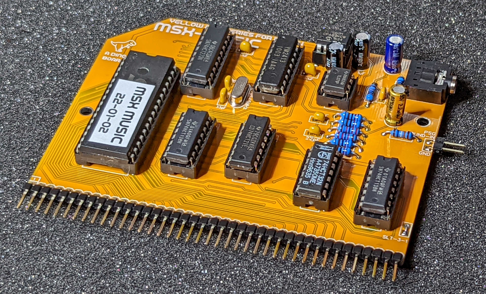
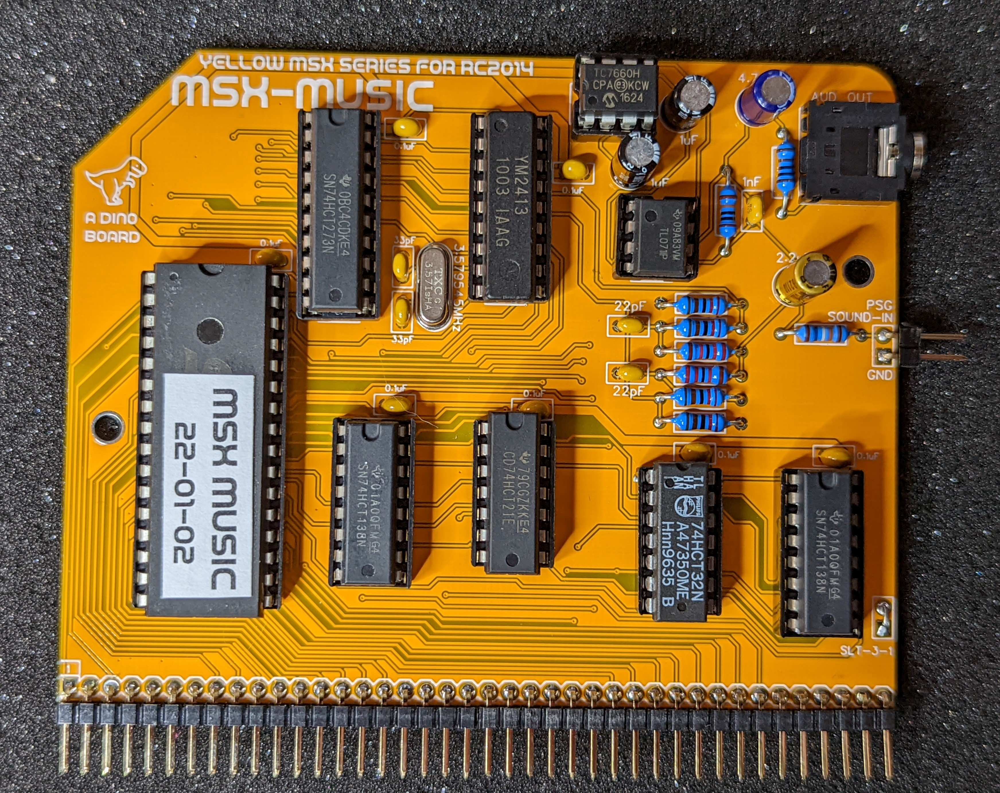
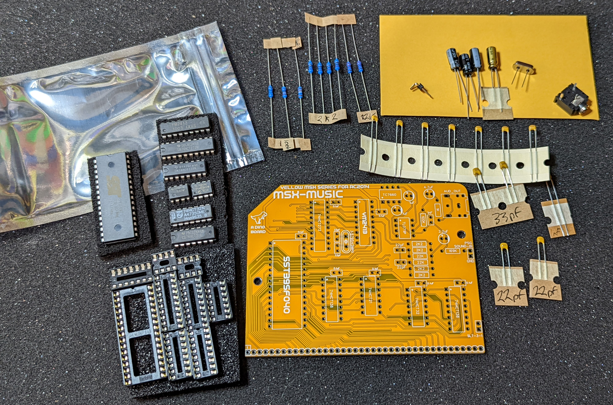
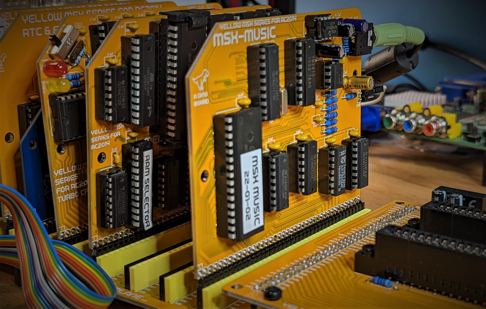
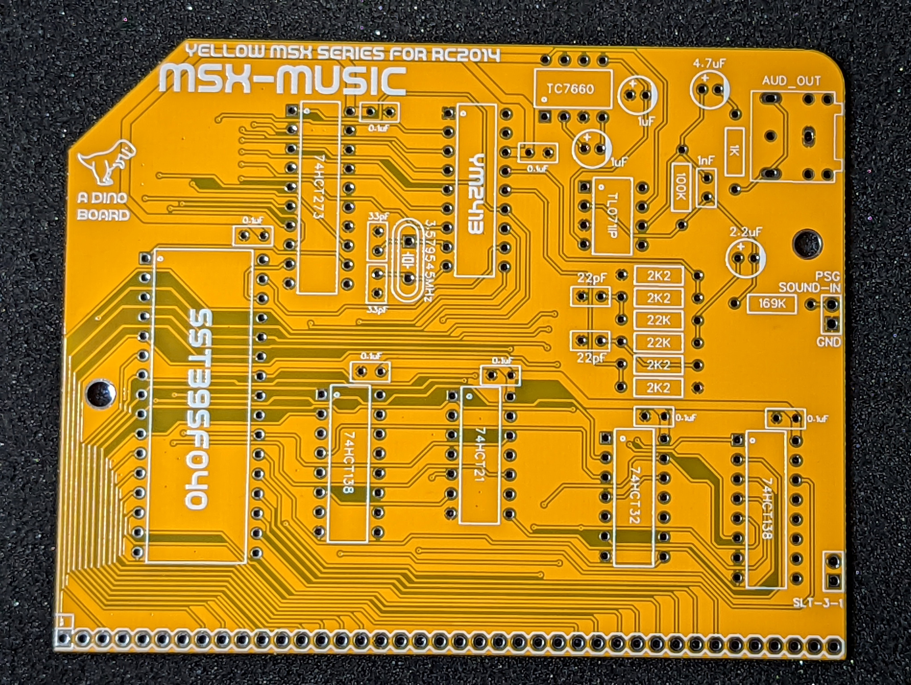
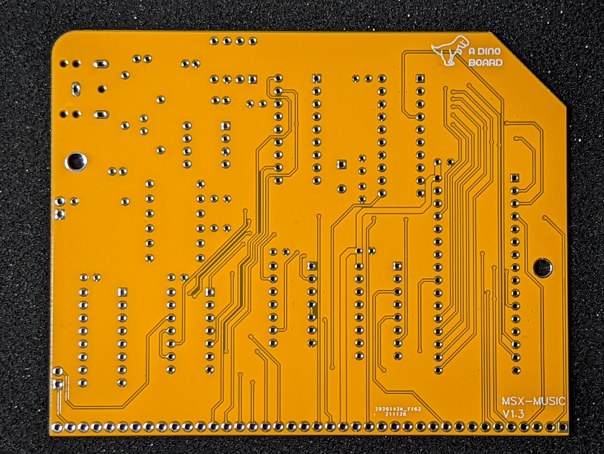

## Hackaday Project:

* [msx-compatible-boards-for-rc2014](https://hackaday.io/project/175574-msx-compatible-boards-for-rc2014)

<a href="https://www.tindie.com/products/dinotron/ym2413-msx-music-module-designed-for-rc2014"></a>

## Title

YM2413 MSX-Music Module Designed for RC2014

## Brief Description

Give your RC2014 MSX build MSX-Music OPLL Sounds

### Description

Explore the world of mid 80s music synthesis sound chips - Yamaha's YM2413 OPLL (FM synthesis) as used in the MSX-MUSIC standard.

### What is it?

This is a kit based around the YM2413 OPLL (FM synthesis) sound chip, and designed to be compatible with the MSX-MUSIC standard.  Add the amazing advanced music generation of Yamaha's OPLL (FM synthesis) YM2413 chip to your RC2014 build, and propel your ears into the new era of 80's sounds.

The OPLL was especially made for the MSX system. It provides 9 channels of FM sound without drums or 6 channels FM sound with 5 FM drums.

The OPLL was also used in Sega Mark III and the Japanese Sega Master System, as well as in arcade machines by SNK and Alpha Denshi, and in a range of Yamaha keyboards.

Th chip supports one user-defined instrument and fifteen read-only hard-coded instrument profiles (violin, guitar, piano, flute, clarinet, oboe, trumpet, organ, horn, synthesizer, harpsichord, vibraphone, synthesizer bass, acoustic bass and electric guitar). The IC can operate either as nine channels of melodic instruments or six melodic channels and five hard-coded percussion instruments (high hat, top cymbal, and tom tom, snare and bass drums).

Installed into a MSX configured RC2014 build, this kit will give your system the ability to run many MSX music tracker applications or compatible games.

The on-board ROM includes the MSX-MUSIC basic extensions enabling the ability to write/run basic program thru its implementation of [Music Macro Language](https://en.wikipedia.org/wiki/Music_Macro_Language) (requires the MSX-Memory board with MSX-BASIC flashed).

With the ability to re-flash (update) the on-board SST39SF040 ROM -- this module also doubles as a simple SST39SF040 ROM programmer.

A video of the board in operation: https://www.youtube.com/watch?v=Sx03ejKu43Y

### Key features:

* Yamaha's YM2413 OPLL (FM synthesis) music chip
* Mix in the audio from the Yellow MSX Game module
* Onboard ROM, with MSX-MUSIC basic extensions and bios implemented
* Full SST39SF040 ROM (re)flashing with MSX-DOS flash utility

### What is the 'Yellow MSX Series of Boards'?

These are a series of boards that I am developing to achieve MSX compatibility for RC2014 systems.

The idea is that you can build each board one at a time, test it and play with it under RomWBW - and then once you have the set - load up some MSX/MSX2+ games!

The V9958 board is the first in that series.

More details can be found on my [hackaday project](https://hackaday.io/project/175574-msx-compatible-boards-for-rc2014)

### What's included in this kit

The full kits includes everything you need (PCB, capacitors, IC sockets, connectors, and the ICs).  The YM2149 are used or old as new stock, tested in circuit by me before shipping.

The SST39SF040 ROM is supplied flashed with MSX-MUSIC extensions for MSX BASIC.

### Bill of Materials

|Count   | Name  |
|:------:|-------|
|  1     | PCB |
|  1     | 3.5mm audio socket|
|  2     |1uF Electrolytic Capacitors|
|  7     |0.1uF Ceramic Capacitors|
|  2     |33pF Ceramic Capacitors|
|  2     |22pF Ceramic Capacitors|
|  1     |1nF Ceramic Capacitor|
|  1     |4.7  Electrolytic Capacitors|
|  1     | 1x2 Right Angle Header |
|  1     | 1K Ω Resistor | 
|  1     | 100K Ω Resistor | 
|  4     | 2K2 Ω Resistor | 
|  1     | 169K Ω Resistor | 
|  2     | 22K Ω Resistor | 
|  1     | Yamaha YM2413 |
|  1     | 74HCT273|
|  2     | 74HCT138 |
|  1     | 74HCT32 |
|  1     | 74HCT21 |
|  1     | SST39SF040 512K NOR Flash ROM |
|  1     | TL071IP opamp |
|  1     | TC7660 charge pump |
|  1     | 3.579545MHz crystal |
|  1     | 32 POS IC SOCKET |
|  1     | 20 POS IC SOCKET |
|  1     | 18 POS IC SOCKET |
|  2     | 16 POS IC SOCKET |
|  2     | 14 POS IC SOCKET |
|  2     | 8 POS IC SOCKET |


### What else do I need to make this work?

* Although it should be possible to operate this module on a stock RC2014 - I am unaware of any software that will drive it, so its recommended you have a fully operational Yellow MSX system on your RC2014 system (memory, video, etc)*

* The onboard MSX-MUSIC basic extensions, requires your main Memory board has MSX-BASIC installed.  The MSX-MUSIC programming feature can be used to create a new main ROM.

\* The onboard ROM can only be accessed when running your RC2014 in full MSX configuration.

### Port Mapping

The board uses the standard IO addresses for MSX systems.

| Port |	Description|
|------|-------------|
| $7C	(w) | YM2413 register index  |
| $7D	(w) | YM2413 register data  |

### Rom page selection

The onboard ROM is wired to SLOT 3-1 and is expected to be mapped to page 1 (addresses: 0x4000-0x7FFF).

On power-up and reset, the SST39SF040 ROM's first 16K bank will be mapped to this page.  To change the bank, you can write to address: 

`0x7DF7 in PAGE 1`

or write to address

`0xE000 in PAGE 3.`

> If SLOT 3-1 is mapped into page 3 (0xC000-0xFFFF), only the page selection register will respond to write operations - the ROM will not be selected for read or write operations for page 3 addresses.  This enables selecting addressing of the ROM address lines, without conflicting with the SST39SF040's write program commands. 

## Software

### vgmplay.com

This MSX-DOS application written by Laurens Holst, that will play VGM and VGZ music files.  See the author's site for more details: http://www.grauw.nl/projects/vgmplay-msx/

This application can be used in a CBIOS environment (with MSX-BASIC) - but you need to have version xxxx-xx-xx or later flashed in the main ROM.

### Running MSX-BASIC code

You can run MSX-BASIC code to test out the module, a very simply basic script is as follows:

```
10 CALL MUSIC
20 PLAY #2, "CDEFAB"
RUN
```

you can also try a couple of example scripts included in this repo:

* [msx/sample.txt](./sample.txt)
* [msx/clowns.txt](./clowns.txt)

upload these files to your system, and then at the msx-dos prompt type:

`BASIC SAMPLE.TXT` or `BASIC CLOWNS.TXT`

### muflash.com

This is a little utility that can re-flash the on-board ROM.

```
Usage:  muflash <filename>

  Flash the onboard ROM of the MSX MUSIC Module
    filename
      The file name of image to flash
```

### Updating the onboard MSX-MUSIC rom image

You can naturally re-flash the SST39SF040 ROM chips using your favourite external programmer such as the TL866II Plus programmer.

Or you can use the inherent capabilities of the MSX-MUSIC module to update its own image using the `muflash.com` MSX-DOS utility.

To update the image on the ROM to a later version -- follow these steps:

1. Download (or assembly your own version) from the github's release page, https://github.com/vipoo/yellow-msx-series-for-rc2014/releases, the file `msx-rc2014-XX-XX-XX.zip`
2. Extract the `rcmusic.rom` and `muflash.com` files from this zip file
3. Copy the `rcmusic.rom` and `muflash.com` files to your system (Compact Flash or via serial to RAMDISK)
4. At the MSX-DOS prompt - run the command `muflash rcmusic.rom`
5. Reboot your machine.
6. The new version of MSX-MUSIC rom will now be active.

### Using the MSX-MUSIC to update your main rom's image.

Although it is technically possible with the latest revision of the MSX-Memory module to flash a new version of the ROM image, the problem is if something goes wrong during flashing, you may end up with a ROM image that does not boot.

By using the flashing capability of the MSX-MUSIC module, and swapping the ROM chips you can safely update your MSX-Memory rom image.

To do this process, the Compact Flash module (or some other storage solution) is required.  The RAMDISK is not large enough to perform this process.

To perform a MSX-Memory ROM update using the MSX-MUSIC flashing capability, following these steps:

1. Download (or assembly your own version) from the github's release page, https://github.com/vipoo/yellow-msx-series-for-rc2014/releases, the file `msx-rc2014-XX-XX-XX.zip`
2. Extract the `muflash.com` and the rom image you would like to apply to your MSX-Memory system (eg: `msxsyssrc-rc2014-japan-with-rtc.rom`)
3. Copy the ROM image to your Compact Flash card (renaming to 8.3 file name eg: `msxjapan.rom`)
4. From the MSX-DOS prompt run the command `muflash msxjapan.rom`
5. Power off your system, and swap the SST39SF040 ROM chips between the MSX-Memory and MSX-MUSIC modules
6. Reboot.  Your system should now be running the desired image.
7. If it fails to boot, simply swap the ROM's back to restore your system.
8. If flashing was successful, you can following the process above to now flash the MSX-MUSIC rom

## Disclaimer

Please note that this is a kit, produced by a non-professional (me) for hackers, DIYers' and retro lovers, to tinker with. I will do my best to answer any support questions you may have.

## Images

Assembled
---------




Basic kit
---------


Installed
---------


PCB Front
---------


PCB Back
---------


## Resources

* Schematic: [schematic.pdf](./schematic.pdf "Schematic")
* Datasheet: [YM2413-Yamaha.pdf](./YM2413-Yamaha.pdf "YM2413-Yamaha Datasheet")

## References

Hackaday Project: [msx-compatible-boards-for-rc2014](https://hackaday.io/project/175574-msx-compatible-boards-for-rc2014)

Kits available at: https://www.tindie.com/products/dinotron/ym2413-msx-music-module-designed-for-rc2014/

* https://arduinoplusplus.wordpress.com/2020/02/22/making-music-with-a-yamaha-ym2413-synthesizer-part-2/
* https://arduinoplusplus.wordpress.com/2020/03/07/making-music-with-a-yamaha-ym2413-synthesizer-part-3/
* https://raw.githubusercontent.com/RBSC/F4-FMPAC/master/Doc/schematics.png
* https://i0.wp.com/www.msxinfo.net/wp-content/uploads/2014/03/fmpak.jpg
* https://arduinoplusplus.files.wordpress.com/2019/11/ym2413_schematic.png
* http://www.waveguide.se/?article=46&file=mc3-io-ym2413-sch.png
* http://www.waveguide.se/?article=the-ym2413-fm-opll
* http://www.grauw.nl/projects/vgmplay-msx/
* http://vgmrips.net/
* http://www.smspower.org/Music/VGMs
* http://opl.wafflenet.com/
* https://www.msx.org/wiki/MSX-MUSIC
* https://www.msx.org/wiki/MSX-MUSIC_BASIC
