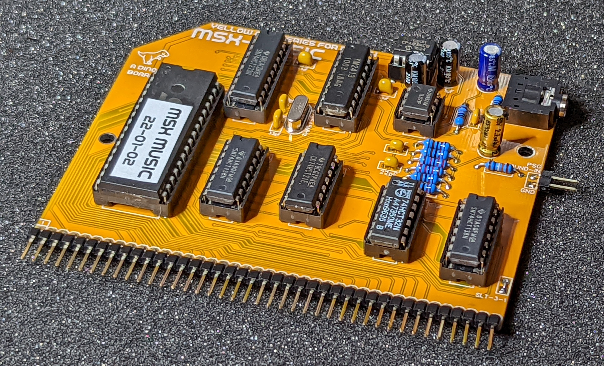
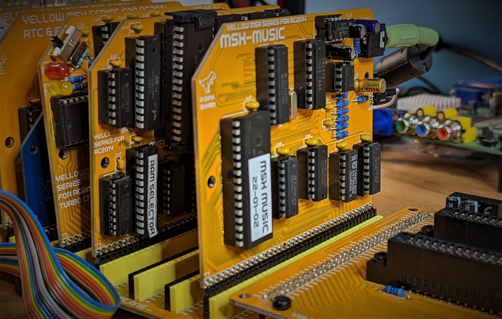
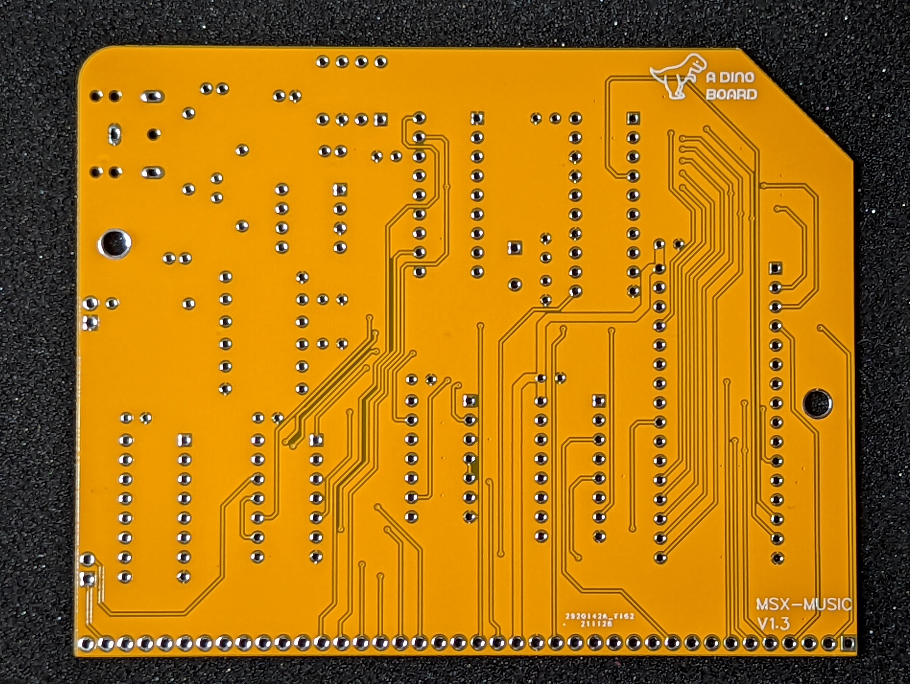

## References

Hackaday Project: [msx-compatible-boards-for-rc2014](https://hackaday.io/project/175574-msx-compatible-boards-for-rc2014)

Kits available at: https://www.tindie.com/products/dinotron/?????

https://arduinoplusplus.wordpress.com/2020/02/22/making-music-with-a-yamaha-ym2413-synthesizer-part-2/
https://arduinoplusplus.wordpress.com/2020/03/07/making-music-with-a-yamaha-ym2413-synthesizer-part-3/

https://en.wikipedia.org/wiki/Music_Macro_Language
ym2413-Yamaha.pdf

## Title

YM2413 MSX-Music Module Designed for RC2014

## Brief Description

Explore the world of early music synthesis sound chips - Yamaha's YM2413 OPLL (FM synthesis) as used in the MSX-MUSIC standard.

### Description

### What is it?

This is a kit based around the YM2413 OPLL (FM synthesis) sound chip, and designed to be compatible with the MSX-MUSIC standard, 
will add the amazing advanced music generation of Yamaha's OPLL (FM synthesis) YM2413 chip to your RC2014 build, and propel your ears into the new era of 80's sounds.

The OPLL was especially made for the MSX system. It provides 9 channels of FM sound without drums or 6 channels FM sound with 5 FM drums. 

The OPLL was also used in Sega Mark III and the Japanese Sega Master System, as well as in arcade machines by SNK and Alpha Denshi, and in a range of Yamaha keyboards. It provides 9 channels of FM sound without drums or 6 channels FM sound with 5 FM drum channels.

Th chip supports one user-defined instrument and fifteen read-only hard-coded instrument profiles (violin, guitar, piano, flute, clarinet, oboe, trumpet, organ, horn, synthesizer, harpsichord, vibraphone, synthesizer bass, acoustic bass and electric guitar). The IC can operate either as nine channels of melodic instruments or six melodic channels and five hard-coded percussion instruments (high hat, top cymbal, and tom tom, snare and bass drums). 

Installed into a MSX configured RC2014 build, this kit will give your system the ability to run many MSX music tracker applications or compatible games.

The on-board ROM includes the MSX-MUSIC basic extensions, allowing for playing music thru an implementation of [Music Macro Language](https://en.wikipedia.org/wiki/Music_Macro_Language) (requires the MSX-Memory board with MSX-BASIC flashed).  

With the ability to re-flash (update) the on-board SST39SF040 ROM -- this module also doubles as a simple SST39SF040 ROM programmer.

A video of the board in operation: https://www.youtube.com/watch?v=Sx03ejKu43Y

### Key features:

* YM2413 onboard chip
* Merge audio from Yellow MSX Game's audio
* On board ROM, with MSX-MUSIC extensions implemented
* Full SST39SF040 ROM (re)flashing with MSX-DOS flash utility

### What is the 'Yellow MSX Series of Boards'?

These are a series of boards that I am developing to achieve MSX compatibility for RC2014 systems.

The idea is that you can build each board one at a time, test it and play with it under RomWBW - and then once you have the set - load up some MSX/MSX2+ games!

The V9958 board is the first in that series.

More details can be found on my [hackaday project](https://hackaday.io/project/175574-msx-compatible-boards-for-rc2014)

### What's included in this kit

The full kits includes everything you need (PCB, capacitors, IC sockets, and the ICs).  The YM2149 are used or old as new stock, tested in circuit by me before shipping.

The SST39SF040 ROM is supplied flashed with MSX-MUSIC extensions for MSX BASIC. 

### What else do I need to make this work?

* Although it should be possible to operate this module on a stock RC2014 - I am unaware of any software that will drive it, so its recommended you have a fully operational Yellow MSX system on your RC2014 system (memory, video, etc)

* The onboard MSX-MUSIC basic extensions, requires your main Memory board has MSX-BASIC installed.  The MSX-MUSIC programming feature can be used to create a new main ROM.

## Disclaimer

Please note that this is a kit, produced by a non-professional (me) for hackers, DIYers' and retro lovers, to tinker with. I will do my best to answer any support questions you may have.

## Images

Assembled
---------

Basic kit
---------

Installed
---------

PCB Front
---------

PCB Back
---------

## Resources

* Schematic: [schematic.pdf](./schematic.pdf "Schematic")
