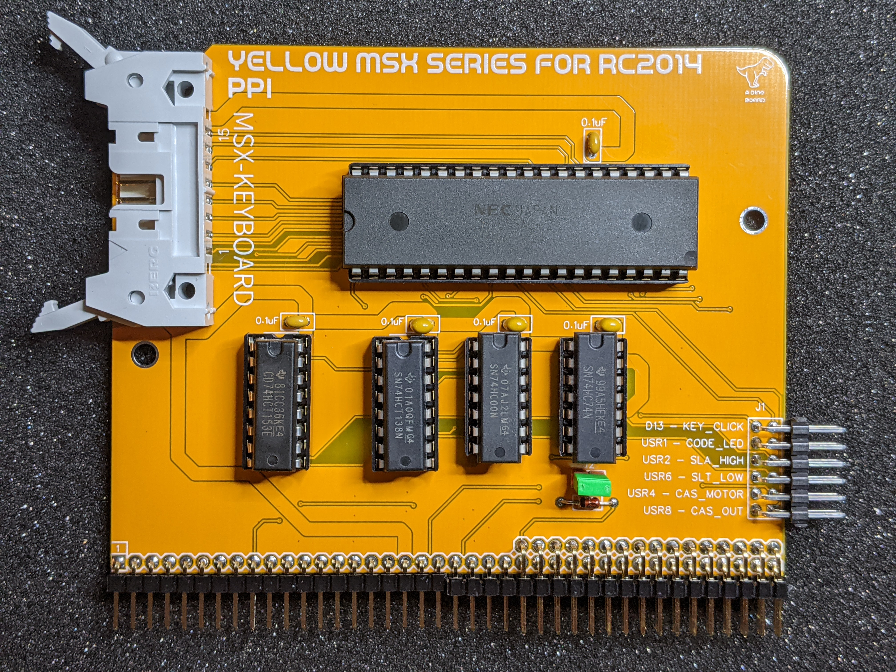
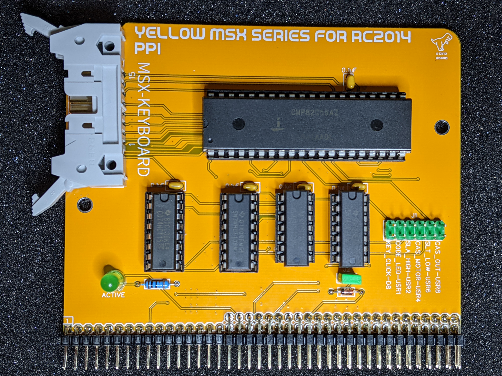
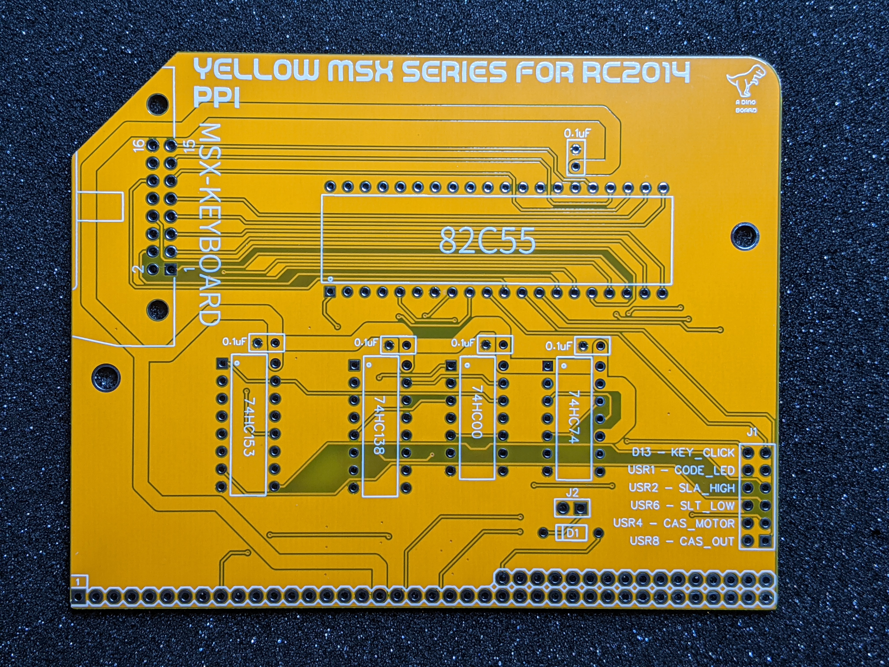
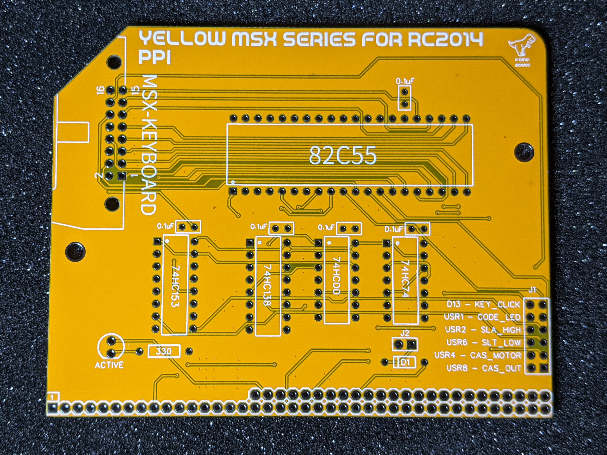
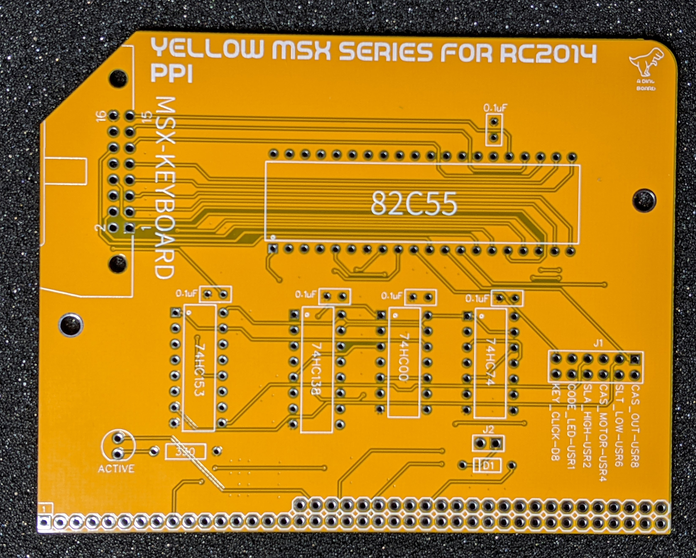

# PPI Board Designed for RC2014

Hackaday Project: [msx-compatible-boards-for-rc2014](https://hackaday.io/project/175574-msx-compatible-boards-for-rc2014)

The PPI 82C55 board, designed for RC2014 systems, is part of planned series of boards, to provide full MSX2+ compliance.

It provides interface to keyboard and memory slot management for the ROM/RAM board.

Key Functions:

* Designed around a Renesas 82C55 chip, a modern CMOS version of the original Intel 8255 Programmable Peripheral Interface chip.
* IDC interface for full size MSX compatible keyboard.
* MSX Slot selector lines for the ROM/RAM board.
* Optional MSX M1 Wait state generator.

This board also has outputs for Cassette Audio out and Cassette Motor control, but I have yet to test this myself.

## Bill of Materials

|Count   | Name                    |  Designator |
|:------:|-------------------------|-------------|
| 5      | 0.1uF                   | C1,C3,C4,C2,C5 |
| 1      | 1N4148                  | D1 |
| 1      | EXT-BUS                 | J1 |
| 1      | M1-WAIT                 | J2 |
| 1      | MSX-KYB                 | P1 |
| 1      | 82C55                   | U1 |
| 1      | 74HC138                 | U2 |
| 1      | 74HC00                  | U3 |
| 1      | 74HC153                 | U4 |
| 1      | 74HC74                  | U5 |
| 1      | Right Angle 20x2 Header | B1 |
| 1      | Right Angle header 1x20 | B1 |
| 2      | 14                      | POS IC SOCKET |
| 2      | 16                      | POS IC SOCKET |
| 1      | 40                      | POS IC SOCKET |

## Sample Apps

The msxkeyb.com application can be used to test the keyboard matrix lines are working correctly.

## Port Mapping

Standard MSX port mapping.

| Port |  Description
|:------:|-------------|
| #A8    | PSL_STAT: slot status |
| #A9    | KBD_STAT: keyboard status |
| #AA    | GIO_REGS: General IO Register |
| #AB    | PPI_REGS: PPI register |

For more see [msx.org wiki page](https://www.msx.org/wiki/Programmable_Peripheral_Interface)

## Using keyboard on RomWBW

Although the keyboard and PPI board are designed to work under MSX software, it can be used in a stock RC2014 build.

You can write your own software to interface to the keyboard (see the demo app msxkeyb), or you can activate the
custom driver written for RomWBW's HBIOS.  The drivers code is on my fork of [RomWBW](https://github.com/vipoo/RomWBW/tree/yellow-msx-boards).

## Jumper Configuration

J1 maps the extended bus lines.  The pins can be shorted to direct the signals to the extended bus lanes if the back-plane supports these lines.  Alternatively wire jumpers as required between boards.

J2 enables the onboard wait generator.  For MSX compatibility, a WAIT state needs to be generated during M1 cycles for memory access.  Short this jumper to enable the wait states.

> In the olden days, memory was slow, so MSX induced a wait state during M1 cycles for instruction reading. Some software assume, for timing purposes, that this always happens - if the wait state is not there, some software will glitch or fail.

## Revisions

Revision v1.5
* The extended bus mapping pins have been rotated and moved to the edge. Allows right angle header, enabling board to be mounted adjacent to other nearby boards.

Revision v1.6
* Minor routing changes and removed the power LED.

## Images

Assembled (v1.6)
---------

Assembled (v1.4)
---------

Revision v1.6
-------------

Revision v1.5
-------------

Revision v1.4
-------------

## Resources

* Schematic: [schematic.pdf](./schematic.pdf "Schematic")
* [82C55 Datasheet](../datasheets/82c55.pdf)

## Other references

* [Keyboard matrices - Grauw](http://map.grauw.nl/articles/keymatrix.php)
* [MSX ORG PPI Page](https://www.msx.org/wiki/Programmable_Peripheral_Interface)
* [MSX Red Book](https://github.com/gseidler/The-MSX-Red-Book/blob/master/the_msx_red_book.md)
