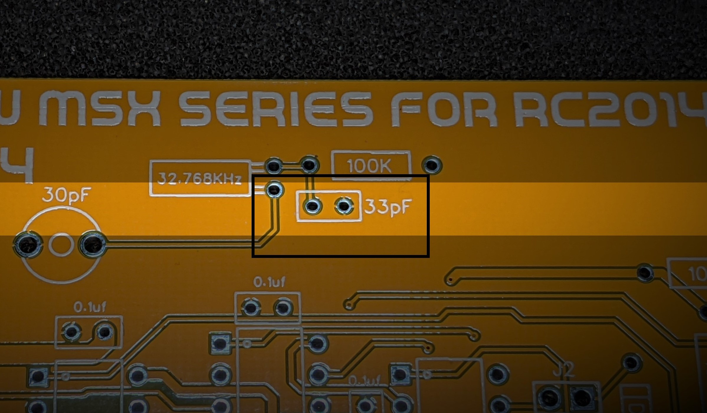
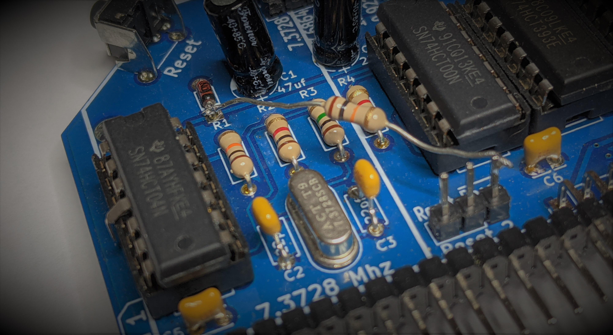
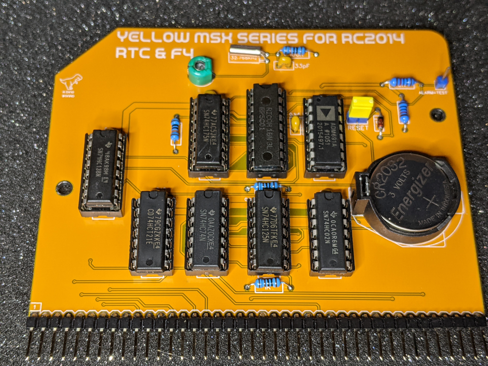
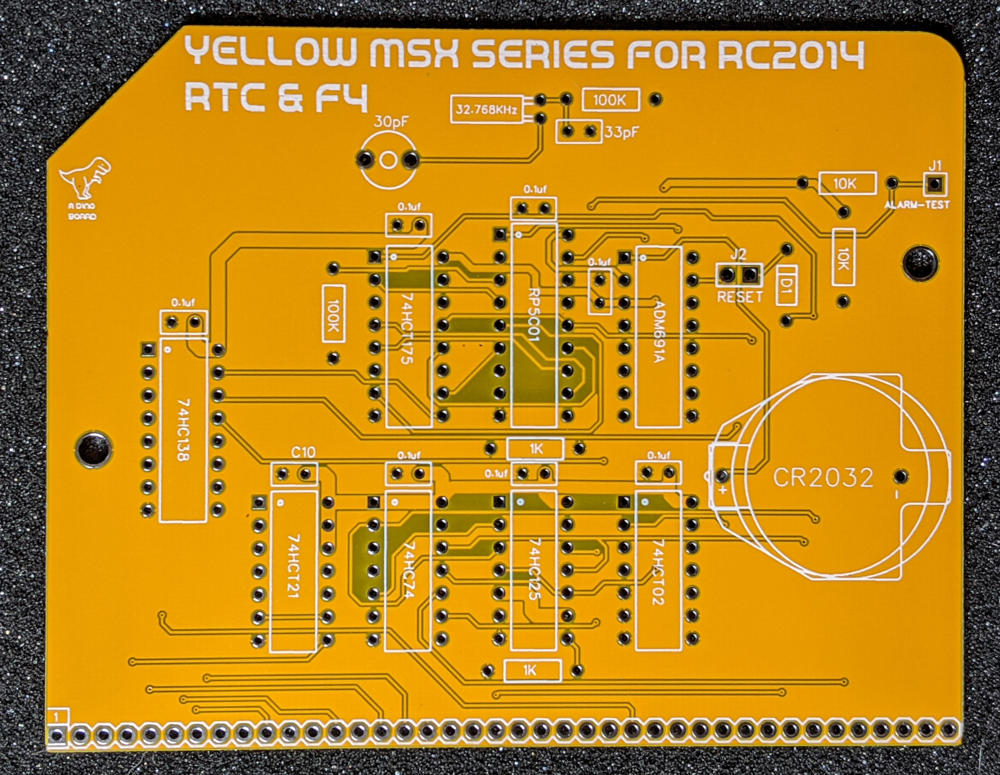
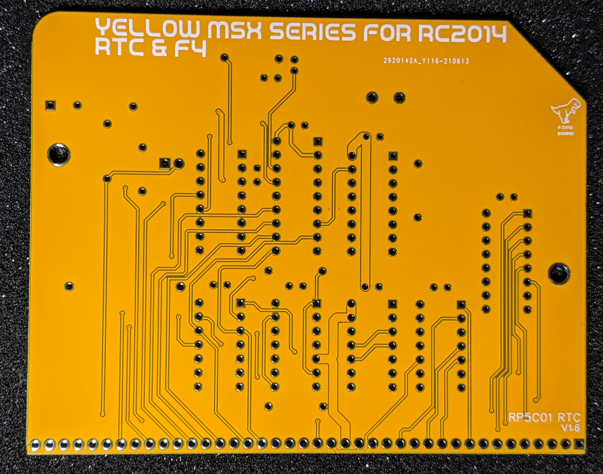
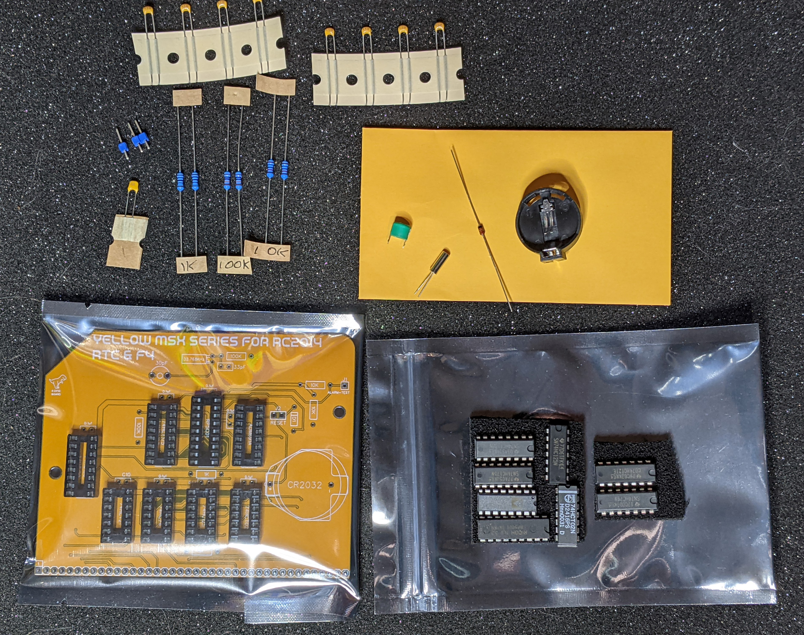

# MSX Compatible RTC/F4 register for RC2014

Hackaday Project: [msx-compatible-boards-for-rc2014](https://hackaday.io/project/175574-msx-compatible-boards-for-rc2014)

<a href="https://www.tindie.com/products/dinotron/msx-rp5c01-rtc-and-msx-f4-board-for-rc2014"></a>

This module is part of the Yellow MSX series of modules to give your RC2014, MSX compatibility, providing two key capabilities:

* A RTC based on the RP5C01 chip, as per the MSX2 specification.
* And a F4 warm boot register, as per the MSX2+ specification.

In addition, the module can also provide an optional power on reset signal.  See notes below.

### Errata (1.6 revision)

The ceramic capacitor value for the main clock should be 30pf, not 33pf.

With a 33pf, the clock will work but may run a little slow.  Decreasing the capacitor's value will make the clock run a little faster.

Individual cases may vary, so the kit has been supplied with 27pf, 30pf and 33pf to allow for experimentation.




## RP5C01 based RTC

The RPC501 by RICOH, is a chip that maintains a time/date counter and is powered by a coin CR2032 battery, when the machine is switched off.

In addition to keeping time, it also has a small amount of onboard RAM, that is also powered by the battery when main power is off.  This RAM can be used to store machine specific settings, such as boot screen color and mode.

You can access the chip directly thru the relevant ports, but under MSX, the 'correct' way is via the sub-rom bios calls:

```
REDCLK
Address  : #01F5
Function : Read clock-RAM
Input    : C  - clock-RAM address
                xxBBAAAA
                  ||++++-- address
                  ++------ Block-number
Output   : A  - Read value in lowest four bits
Registers: F

WRTCLK
Address  : #01F9
Function : Write clock-RAM
Input    : C  - clock-RAM address
                xxBBAAAA
                  ||++++-- address  :
                  ++------ Block-number
           A  - Value to write
Registers: F
```
[Source](http://map.grauw.nl/resources/subrom.php)

For more information on how to use and program the chip, checkout the [msx.org page](https://www.msx.org/wiki/Ricoh_RP-5C01).

## F4 Boot Register

The MSX2+ standard introduced the F4 Boot register.  This is a register that, only when power is first applied, will reset itself.  Thereafter only a software command will change the state of the register.  For example, when the user reset the computer, the state of this register is not altered. This allows the software to know if the system had a cold or warm boot.

MSX2+ system roms utilised this capability, to skip ram checks and the logo/boot screen, during warm boots.

You can read the boot status, by reading the port at, you guessed it, $F4.  The MSX bios will on a cold boot, reset BIT 7 of this register.  The MSX bios has a couple of functions related to this register (RDRES, WRRES).

```
RDRES
Address  : #017A
Function : Read value of I/O port #F4
Input    : None
Output   : A = value read
Registers: AF

WRRES
Address  : #017D
Function : Write value to I/O port #F4
Input    : A = value to write
           When bit 7 is reset it shows the MSX 2+ startup screen on boot,
           and counts and initialises the RAM.
Output   : None
Registers: None
```

[Source](http://map.grauw.nl/resources/msxbios.php)

## Power on reset

The circuits power is managed by the ADM691 based supervisory circuit.  This chip mantains power to the RP5C01 by switching between the battery and the main power.

The ADM691 chip has the ability to generate a reset signal, when main power is turned on.  This can be mapped to the Z80's reset line to ensure the CPU always has a clean reset at startup.

There is a jumper (J2) on the board to map this signal to the RESET line on the backplane.  If you jumper this line, it will drive the RESET low on initial powering.  This is an open drain connection - as such it does not hold the line high.

The RC2014 Dual Clock Module, also has a reset on power circuit.  The Dual Clock Module's circuit does have an issue - see [Paul Williamson's Must Be Art Blog Post](https://www.mustbeart.com/wp/2019/04/27/reset-mod-for-rc2014-dual-clock-and-reset-board/) for details and a specific modification.

For my specific setup, the Dual Clock's Reset on Power circuit would not always reliably trigger a reset.  And so I decided to disable it and use the Reset on Power function provided by the ADM691 chip.

My modification is simpler than that applied by Paul Williamson's posting, as I just wanted to fully disable the circuit.  (But i still needed the line to be held high with a pull up resistor)

My modification was to:

1. Remove PIN 4 from U1:

Disconnect the connection between the 74HCT04 gate output and the RESET line.


2. Solder a 10K resistor:

Apply a 10K resistor to the RESET line and VCC.  I used the cathode point of D1 as shown:




## Calibrating

The RTC module requires calibration.  There is a small trimmer capacitor that will provide a very small change to the clock frequency.

If the module is not calibrated, the clock will still work, but may slowly gain or lose time.

> Please note, I can provide no guarantees as to the accuracy of this clock over time with or without calibration.

To aid in calibration, I wrote a small MSX-DOS application `RTCCALB.COM`, that allows you to calibrate the RTC against your CPU's clock.  This should allow for a good approximation.  Do not worry if you can not get the clock the sync with the CPU clock.  Just get as close as you can.  If you notice your clock is gaining or losing time, you may want to retry calibration and apply a fudge factor to your calibration.

You can build the application from within this repo, or download a pre-compiled version under the github [releases](https://github.com/vipoo/yellow-msx-series-for-rc2014/releases)

## Synchronizing with external time using ESP8266 Wifi Module.

It is possible to synchronise the RTC via the ESP8266 to an internet synchronised clock.  It requires the WIFI module and SIO/2 be linked via the 2nd serial channel.  The `ESP8266.COM` application along with custom firmware for the ESP8266 are still under development.  See the [Hackaday project log](https://hackaday.io/project/175574-msx-compatible-boards-for-rc2014/log/197686-integrating-the-rc2014-wifi-module) for current status.

## RomWBW

A driver for this chip has been submitted and accepted by Wayne Warthen, currently on the pre-release dev branch.

[https://github.com/wwarthen/RomWBW/blob/dev/Source/HBIOS/rp5rtc.asm](https://github.com/wwarthen/RomWBW/blob/dev/Source/HBIOS/rp5rtc.asm)


## Port Mappings

| Port |  Description
|------|--------------------|
|  B4    | RP5C01 Register Selection |
|  B5    | RP5C01 Data R/W  |
|  F4    | BIT 7 Cold/Warm Boot state |

## Bill of Materials

|Count   | Name  |  Designator |
|:------:|-------|-------------|
| 1      |	CR2032 Holder  |	B1 |
| 8      |	0.1uf |	C1,C2,C3,C4,C8,C9,C7
| 1      |	33pF |	C5 |
| 1      |	Trimmer Capacitor | C6
| 1      |	1N4148	| D1,D2,D3,D4
| 1      |	HEADER 1x1 |	J1
| 1      |	HEADER 1x2 |	J2
| 2      |	10K Ω |	R2,R6
| 2      |	100K Ω |	R3,R4
| 2      |	1K Ω |	R5,R7
| 1      |	RP5C01|	U1 |
| 1      |	74HCT175	| U2 |
| 1      |	ADM691A	 | U3 |
| 1      |	74HCT138	| U4 |
| 1      |	74HCT02	| U5 |
| 1      |	74HC125	| U6 |
| 1      |	74HC74	| U7 |
| 1      |	74HCT21	| U8 |
| 1      |	32.768KHz |	X1
| 0      |	Right Angle | 20x2 Header
| 2      |	Right Angle | 1x20 Header

## PCB

Assembled
---------


PCB Front
---------


PCB Back
---------


Kit Parts
---------



## Datasheets & Schematics

* Schematic: [schematic.pdf](./schematic.pdf "Schematic")
* [RP5C01](./ricoh_rp5c01.pdf).
* [ADM691](./ADM691_AnalogDevices.pdf)
