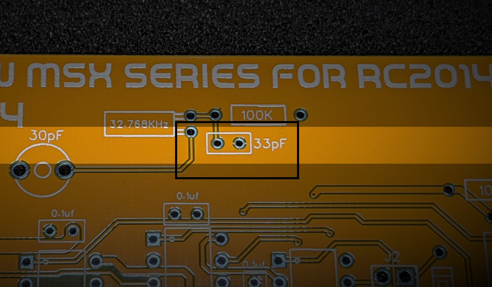

## Errata for Revision 1.6

The ceramic capacitor value for the main clock should be 30pf, not 33pf.

With a 33pf, the clock will work but may run a little slow.  Decreasing the capacitor's value will make the clock run a little faster.

Individual cases may vary, so the kit has been supplied with 27pf, 30pf and 33pf to allow for experimentation.

