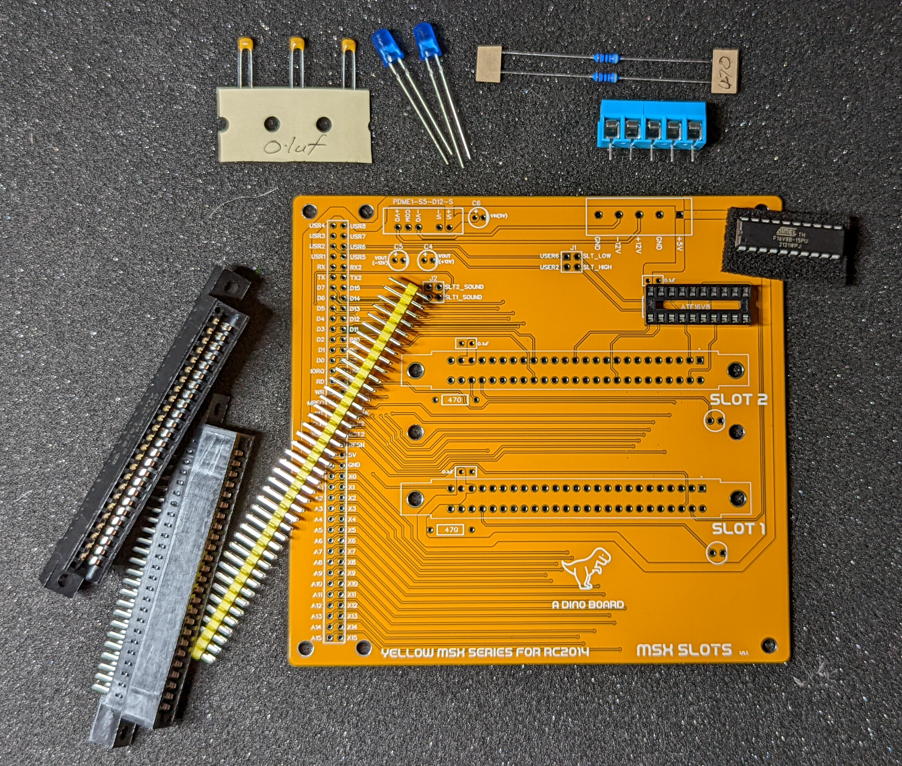

## Hackaday Project:

* [msx-compatible-boards-for-rc2014](https://hackaday.io/project/175574-msx-compatible-boards-for-rc2014)
* [With Cartridge Extension Board](https://hackaday.io/project/175574-msx-compatible-boards-for-rc2014/log/199897-backplane-and-cartridge-extension)
* [Slot Extension Update](https://hackaday.io/project/175574-msx-compatible-boards-for-rc2014/log/200617-slot-extension-for-msx-cartridges)

<a href="https://www.tindie.com/products/dinotron/msx-cartridge-slot-extension-for-rc2014-bus"></a>

## Title

MSX Cartridge Slot Extension for RC2014 Bus

## Brief Description

A extension module for RC2014 backplanes to support MSX Cartridges


### Description

Tired of slow load times for your games?  Miss the days of flicking the power button and having your game instantly running?  Well perhaps this kit is for you.  Pair the Slot Extension with a MSX configured RC2014 build, and you can load cartridge based games and software with the simple of a flick of the power button.  

This module attaches to the right most slot on a RC2014 backplane and gives your RC2014 two 50pin MSX card connectors slots.  It include required decoding logic for addressing the slots as per the MSX standard.

It includes optional support for an on-board DC converter to step up the 5V from the RC2014 backplane to +12/-12 voltages. 

Once installed and operating on a MSX configured RC2014, you can boot up original 1980's MSX cartridges or install new modern release cartridges from places such as https://www.msxcartridgeshop.com/

Or perhaps you can select the optional MSX Cartridge 16K/32K ROM board and flash your own (or downloaded) game and enjoy the era of instant gaming.

### Key features

* 2 MSX 50pin compatible cartridge slots 
* Indicator LEDs when a cartridge is inserted and powered.
* Optional DC converter to supply +12/-12V*
* Optional 16K/32K blank rom for you to flash**

Please note that mounting stand-offs are not supplied.

\* Most cartridges do not need or use the 12V lines.  A 5 way screw power terminal is provided if you wish supply the +12V/-12V from an external source.  
\*\* The supplied ROM is a blank SST39SF040 Flash chip.  You will need an external programmer to flash this chip. 

You will also need a programmer to flash the ROM SST39SF040 -- I have used the [TL866II Plus from XGecu](http://www.xgecu.com/en/). You should be able to source original units your favourite marketplaces, such as AliExpress or ebay.

I suggest you have a look at xgecu's guide at http://www.xgecu.com/en/note.html to help you in identifying counterfeit/clone units - to ensure you get an authentic programmer.

### What is the 'Yellow MSX Series of Boards'?

These are a series of boards developed to achieve MSX compatibility for [RC2014](https://rc2014.co.uk/) systems.

The idea is that you can build each board one at a time, test it and play with it under RomWBW - and then once you have the set - load up some MSX games!

More details of the development of the Yellow MSX series of modules can be found on my [hackaday project](https://hackaday.io/project/175574-msx-compatible-boards-for-rc2014)

And for RC2014 details, check out its official site https://rc2014.co.uk/

### Other MSX Modules Required

The MSX Cartridge slot extension is designed to work in a RC2014 with the Yellow MSX Modules for RC2014.  Your RC2014 needs to be able to boot as a MSX system. 

You need at a minimum:

1. Yellow MSX Series Memory Module designed for RC2014
2. Yellow MSX Series Video Module designed for RC2014 (RGB or Advanced)
3. Yellow MSX Series Game Module designed for RC2014
4. Yellow MSX Series Keyboard/PPI Module designed for RC2014
5. A CPU & Clock

It is recommended that you use a backplane that carries all 8 of the RC2014 user lines - otherwise you will need to map the SLT-HIGH (USER-6) and SLT-LOW (USER-2) signals from the PPI module to both the Memory and the Slot Extension.  You will also need to ensure there is sufficient space for attaching the slot extension.

The **12+1 Backplane designed for RC2014 systems** carries the required lines and has been fully tested.

If are using a backplane such as the 12+1 Backplane, you can short the corresponding jumpers on the board for sound and SLT-LOW and SLT-HIGH signals.   Otherwise you need to construct a bus for the SLT-xxx lines between the slot-extension, PPI and Memory modules.  (And any other future board that might need the SLT-xxx signals).

### Testing status:

I have tested this slot extension with a limited set of MSX Cartridges.  It has been successfully tested with 3 different MSX1 original cartridges from the 80s, the recent 2021 release of *Mutants from the Deep* from https://www.msxcartridgeshop.com/ and the MegaFlashROM SD Flash unit.  

It also has been successfully tested with the optional 16K/32K ROM Cartridge module. 

#### MegaFlashROM

Operating this cartridge is possible, but it requires the NEXTOR kernel and disk images to be updated.  

The version of NEXTOR currently supplied in the MegaFlashROM, is version 2.1.0.  The version built for the Yellow MSX Memory module, is 2.1.1 (beta). 

Although NEXTOR can operator with 2 kernel systems active, there seems to be a compatibility issue with these 2 versions.

The process below, details how to update the kernel and disk images in the MegaFlashROM to a compatible new version.

> Please note, MegaFlashROM requires the a version MSX-BASIC/BIOS.  It is not compatible with CBIOS, the version of the ROM supplied with the MSX Module.  See the file [msx/README.md](../msx/README.md) for details on updating your main ROM image. 

> At this stage, you also need the Compact Flash module working in your MSX platform, to store the new MegaFlashROM images - These files are currently too large for the RamDisk.  (There is an item on my backlog to remove the need for the CompactFlash module)

**You need to update your Yellow MSX module's ROM image to a full system image (containing MSX-BASIC), from the releases section of the repo, dated after 2021-12-21.**

When you first boot up your system, with the MegaFlashROM installed, NEXTOR should boot, but any attempt to access drives A: and B:, will return an error.

You will need to download into your system onto your Compact Flash drive, the following files:

* `opfxsd.com` from https://www.msxcartridgeshop.com/bin/opfxsd.zip
* `mfr.dsk` (from the releases section of this repo)
* `mfr.nextor-2.1.1.rom` (rename it to short file name such as `mfr.com`) (also from the release section of this repo)

then execute the following at the MSXDOS command prompt:

```
opfxsd mfr.rom /i
opfxsd mfr.dsk /id
```

After that, if you reboot your system, you should boot into Mega Flash Rom's system - with access to all drives.

If you wish to reset your MegaFlashROM, follow the official process to restore your system.

1. Download the file https://www.msxcartridgeshop.com/bin/kernel.zip
2. Copy the KERNEL.DAT on a newly blank SD card (file must be copied without fragmentation)
3. Place SD card in your cartridge
4. reboot your system, holding the UP arrow key
5. Choose option F4 - Install SD kernel


### Compatibility Update

### Bill of Materials for Slot Extension

|Count   | Name                    |
|:------:|-------------------------|
| 3     | 0.1uF ceramic capacitors |
| 1     | ATF16V8  |
| 2     | 5mm LEDS  |
| 2     | 470 Ω resistors |
| 2     | 50 Pin Card Edge Connector |
| 1      | 5 Way Screw Terminal    |
| 1      | PCB   |

#### Optional on-board DC-Converter

|Count   | Name                    |
|:------:|-------------------------|
| 2     | 1uF Capacitor |
| 1     | 4.7uF Capacitor |
| 1     | DC-Converter (MEAN WELL DPU01L-12 or equivalent) |


#### Optional 16K/32K ROM Cartridge

|Count   | Name                    |
|:------:|-------------------------|
| 1     | 0.1uF ceramic capacitors |
| 1      | HEADER 2x9	       | 
| 2     | SHUNTS |
| 5     | 10k Ω resistors |
| 1      | SST39SF040        |
| 1      | PCB   |


### Disclaimer

Please note that this is a kit, produced by a non-professional (me) for hackers, DIYers' and retro lovers, to tinker with. I will do my best to answer any support questions you may have.

## Images

Assembled
---------


Assembled
---------


Profile
---------


Basic Kit
---------


Cartridge Kit
---------


Optional +12V/-12V DC Converter
---------


## Resources

* Slot Extension Schematic: [schematic.pdf](./schematic.pdf "Schematic")
* 16K/32K ROM Schematic: [schematic-rom-cartridge.pdf](./schematic-rom-cartridge.pdf "Schematic ROM Cartridge")

