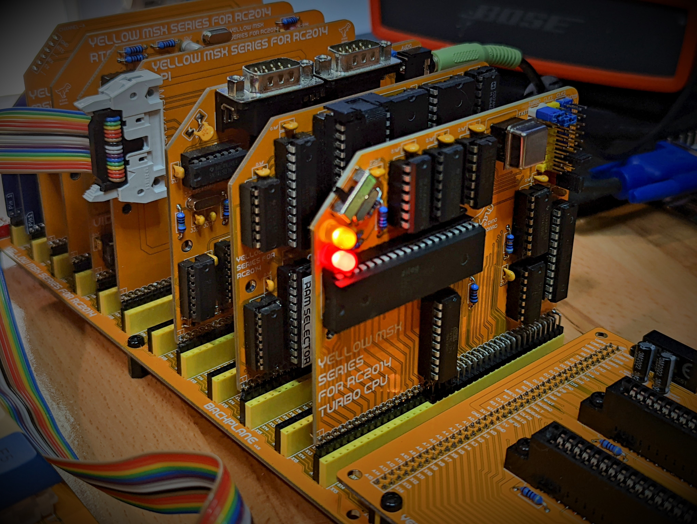

## Hackaday Project:

* [msx-compatible-boards-for-rc2014](https://hackaday.io/project/175574-msx-compatible-boards-for-rc2014)

## Title

Turbo CPU Module Designed for RC2014

## Brief Description

Run a Z80 CPU at up to 20Mhz

### Description

A Z80 CPU module supporting speeds up to 20Mhz - but with the required wait states and clock control to ensure compatibility with existing software and RC2014 modules.

### What is it?

This module is designed to replace your existing RC2014 CPU and Clock Modules and give you the full power of a Z80 running at 20Mhz, yet still be broadly compatible with original software and your other RC2014 modules.

For a RC2014 configured to run a full MSX configuration, you typically need to run your CPU at just 3.5Mhz, as software written for the platform at the time, would assume your system was clocked at this speed.  If you attempt to run programs at a higher cpu clock speed, you will probably get video corruption, I/O problems -- it just wont work!.

But these days, its possible to buy a brand new Zilog Z80 chip, rated at 20Mhz (Z84C0020PEG).  For me in the mid 80s, that would have been an unimaginable speed!

We achieve compatibility by applying a combination of hardware wait states (pausing the CPU for a bit) and automatically slowing the clock down to the 3.5Mhz for short periods of time when the CPU is interacting with your other modules.

A 3 way slider, soldered on the front of the module, gives you total control of the CPU speed.  Using this switch, you can at any time switch into 1 of 3 modes:

1. Full 20Mhz clock speed, with 1 wait state when accessing memory, and slows the clock to 3.5Mhz for 31 clock cycles when it accesses IO devices (SIO/2, PPI, V9958 etc).
2. Full 20Mhz clock speed as mode 1, but with 3 wait states for accessing memory.
3. Standard MSX speed 3.5Mhz CPU, M1 Wait state for accessing memory.

Despite the extra wait states and clock slow down, I have found a typical speed improvement of between 4 and 5 times faster - even for software the does lots of interactions with the V9958, you can still see a very large improvement.

### Key features:

* Support Z80 running at 20Mhz (16Mhz oscillator also supplied if you have issue with your specific kit)
* 3 way slider to select fast, medium or standard speeds
* Blinky Leds to indicate turbo mode and clock slow down states
* PLD to control wait state counts and clock slow down - allowing for experimentation if you want to try other speeds configurations

### What is the 'Yellow MSX Series of Boards'?

These are a series of boards that I am developing to achieve MSX compatibility for RC2014 systems.

The idea is that you can build each board one at a time, test it and play with it under RomWBW - and then once you have the set - load up some MSX/MSX2+ games!

The V9958 board is the first in that series.

More details can be found on my [hackaday project](https://hackaday.io/project/175574-msx-compatible-boards-for-rc2014)

### What's included in this kit

The full kits includes everything you need (PCB, capacitors, IC sockets, connectors, and the ICs).  The 2 PLD chips are flashed with logic to control the wait and clock slow down logic.

Also included is a 20Mhz and an alternative 16Mhz oscillator.

### Operation Reliability

I have tested running at 20Mhz on my specific back-plane and set of modules without any problems.  But due to differences in combination and configuration of RC2014 kits - you may find with your specific situation, there are signal degradation issues at 20Mhz that may cause non-reliable operation.  With the supplied 16Mhz alternative oscillator, you should be able to achieve good operation, but at a slightly lower speed.

### Bill of Materials

|Count   | Name  |
|:------:|-------|
| 8      |	0.1uF |
| 2      |	22pF |
| 1      |	47 Ω |
| 2      |	470 Ω (3.4mm) |
| 1      |	1K Ω |
| 1      |	10K Ω |
| 1      |	1M Ω |
| 1      |	10k Ω Bussed x 6 |
| 2      |	5mm LED |
| 2      |	HEADER 2x8 |
| 1      |	HEADER 2x2 |
| 1      |	HEADER 1x2 |
| 4      |  SHUNTS |
| 1      |	ATF22V10C |
| 1      |	ATF16V8 |
| 1      |	74AC153 |
| 1      |	74AC74 |
| 1      |	74HC74 |
| 1      |	74HC02 |
| 1      |	74HC393 |
| 1      |	Z80 20Mhz |
| 1      |	SP3T Slide Switch |
| 1      |	16 Mhz Oscillator |
| 1      |	20 Mhz Oscillator |
| 1      |	7.3728 Mhz Crystal |
| 2      |	Right Angle 20x2 Header |
| 1      |	40 POS IC SOCKET |
| 1      |	24 POS IC SOCKET NARROW |
| 1      |	20 POS IC SOCKET |
| 1      |	16 POS IC SOCKET |
| 4      |	14 POS IC SOCKET |
| 1      |	8 POS IC SOCKET |
| 1      |	PCB |

### What else do I need to make this work?

You need a RC2014 build.  This can be configured with MSX modules or other modules.

I have tested on a conventional RC2014 build and with the MSX Modules.

It will replace your RC2014 CPU and Clock Modules.

### How does it work?

Running RC2014 build at higher clock speeds presents a few challenges for reliable operation. To increase the CPU clock speed of your system, a few things need to be considered:

1. Whats are the frequency and rise/fall time limits for the back-plane and various modules?  Its very easy to introduce cross talk or other signal quality issues as your clock rate goes up.
2. What the timing limits for the typical RAM/ROM modules. If you try to run your Z80 at 20Mhz, will the RAM and ROM modules keep up?
3. Similarly, whats the timing limits for various I/O devices. Some chips, like the SIO/2 might be rated only to speeds around 6Mhz. It is unlikely such chips will cope with a Z80 running at 20Mhz.
4. In addition devices like the V9958 Video Display Processor have additional timing requirements - the rate of 'commands' that can be sent and executed must not exceed its capacity. If you send drawing commands to this chip too quickly, you will likely get video corruption.

All the various I/O modules and RAM/ROM modules available for RC2014 typically expect an operation frequency of between 3.5Mhz and 7Mhz. So if we increase the clock frequency of the CPU, we have to figure out a way to ensure a wide range of compatibility with all these external modules.

One of the things that work in our favour though, is despite the fact the Z80 is running at 20Mhz, it will not access I/O and memory at this rate.  This is due to the way it requires a few internal clock cycles for various operations, so the effective rate of communications to modules will be lower. For example, all I/O request take at least 4 Clock cycles to complete, and some instructions processed by the Z80 can take up to 20 clock cycles.  We have to consider the timing requirements and operation of the Z80 as described in its datasheet.

The Z80 supports the concepts of additional hardware based wait states.  By designing some logic to enable extra wait states when accessing I/O and memory devices, we can force the CPU to 'wait' or pause for additional clock cycles, thus allowing the I/O and memory chips the time they need to process the read/write requests from the CPU.

It also important to remember, that even at the 3.5Mhz clock speed, the original MSX standard required an extra wait state when reading memory during the M1 cycle.  This was required as the speed of memory, particularly ROM chips of the day, were not able to keep pace with a Z80 running at 3.5Mhz.  Although modern RAM and ROM chips are quite capable of keeping up, if we remove this wait time, original software and games may not work right.

The V9958 in particular, presents a compatibility challenge when running the Z80 at a higher clock speed.  So much original software will be optimise to send commands to the V9958, on the assumption that the CPU is running at 3.5Mhz.  Although, with my testing to date, I found the V9958 can communicate with a Z80 running at 7Mhz.  This will only work as long as our software manages the rate at which it issues commands to the V9958.  Original unaltered software, typically will cause video corruption, even at 7Mhz.

The timing requirements for the V9958 can be quite complicated.  Depending on if you are issuing a command or attempting to access the VRAM the time thats needed between 1 operation and the next can be quite confusing to figure out.  Despite this, the software authors, have optimised this to the highest possible degree.  For a detailed analysis of the timing, check this [article](http://map.grauw.nl/articles/vdp-vram-timing/vdp-timing.html) out.  Any increase in CPU speed without hardware waiting, will cause original software to not work.  But if we go with 'pausing' the CPU to achieve compatibility, running at 20Mhz, we may need to pause the CPU for 90 clock cycles (or more).

So to solve this problem, instead of 'pausing' the CPU, I went for a different approach.  When I/O interactions are undertaken by the Z80, the Z80's clock is switched from the 20Mhz rate, down to the standard 3.5Mhz. The CPU is feed this slow clock for 31 clock cycles (at 3.5Mz), after which it revert the clock back to the full 20Mhz.  I found that about 30 odd cycles was enough to achieve general compatibility.

The clock signal supplied to the CLK1 RC2014 bus is typically independent of the clock signal sent to the CPU.  When the CPU is operating at the full 20Mhz, the CLK1 signal (depending on jumper settings), will continue at its selected rate - typically 3.5Mhz.  So other modules that use this clock signal, such at the SIO/2, will not see any difference in clock signals.

## Oscillator selection and installation.

The kit is supplied with 2 oscillators.  20Mhz and 16Mhz.  You can choose to solder one of these oscillator directly to the PCB - but this would mean if you want to experiment with other turbo speeds, you will need to de-solder the oscillator.

So to make this a little easier, the kit is supplied with an 8pin DIP socket, with the inner pins turned up, so that it will fit the footprint of the oscillator.  It may not be the most elegant solution - but will make changing the oscillator much easier.

Please pay careful attention when you insert the oscillator into the DIP socket (or directly in the PCB), to its orientation.  If you get this wrong, you will almost certainly destroy the oscillator.  You may guess how I found this out!

## Jumper settings for clock control

### CLK1 & CLK2

In the top right of the PCB, you will see all the jumper settings to manage the clock signals for your RC2014.

The jumpers CLK1 and CLK2, set the clock rate to be transmitted on the respective RC2014 clock lines.  Modules such at the SIO/2 use these signals to control the baud rates for its serial communication.  For default MSX configuration, set CLK1 to 3.6864 and CLK2 to 0.3073.

### TURBO
The Turbo Jumper, is use to set the CPU's boost speed.  If you short the bottom 2 pins, the CPU will never run faster than 7.3728 Mhz (stock RC2014) - this is a safe speed that matches the stock RC2014 CPU module.

If you instead short the top 2 pins, then the CPU will be boosted to the speed of the installed oscillator.

### J1

This jumper is typically just shorted.  This jumper maps the 3.6864Mhz clock signal to the CPU slow down speed.  This is the speed the CPU will be clocked at, when any I/O operations are performed (eg when the CPU talks to your other modules such at the serial or video modules).  For MSX configuration, this jumper needs to be shorted.

## PLD Code

This module has 2 (Programable Logic Devices) PLD chips to manage the clock slow down and cpu wait states.

The ATF22V10 is responsible for initiating and holding the clock braking, upon any I/O operation.

[msx/turbo-cpu.pld](../msx/turbo-cpu.pld)

The ATF16V8 is responsible for issuing any additional WAIT states to the CPU.

[msx/turbo-cpu-mwait.pld](../msx/turbo-cpu-mwait.pld)

The 3 way slider's state is sent to these 2 chips to allow the user to select 2 turbo modes or a turbo off mode.

## Disclaimer

Please note that this is a kit, produced by a non-professional (me) for hackers, DIYers' and retro lovers, to tinker with. I will do my best to answer any support questions you may have.

## Images

Installed
---------

Assembled
---------

PCB
---------

Kit
---------

## Resources

* Schematic: [schematic.pdf](./schematic.pdf "Schematic")

## References

Hackaday Project: [msx-compatible-boards-for-rc2014](https://hackaday.io/project/175574-msx-compatible-boards-for-rc2014)

Kits available at: https://www.tindie.com/products/dinotron/?????
