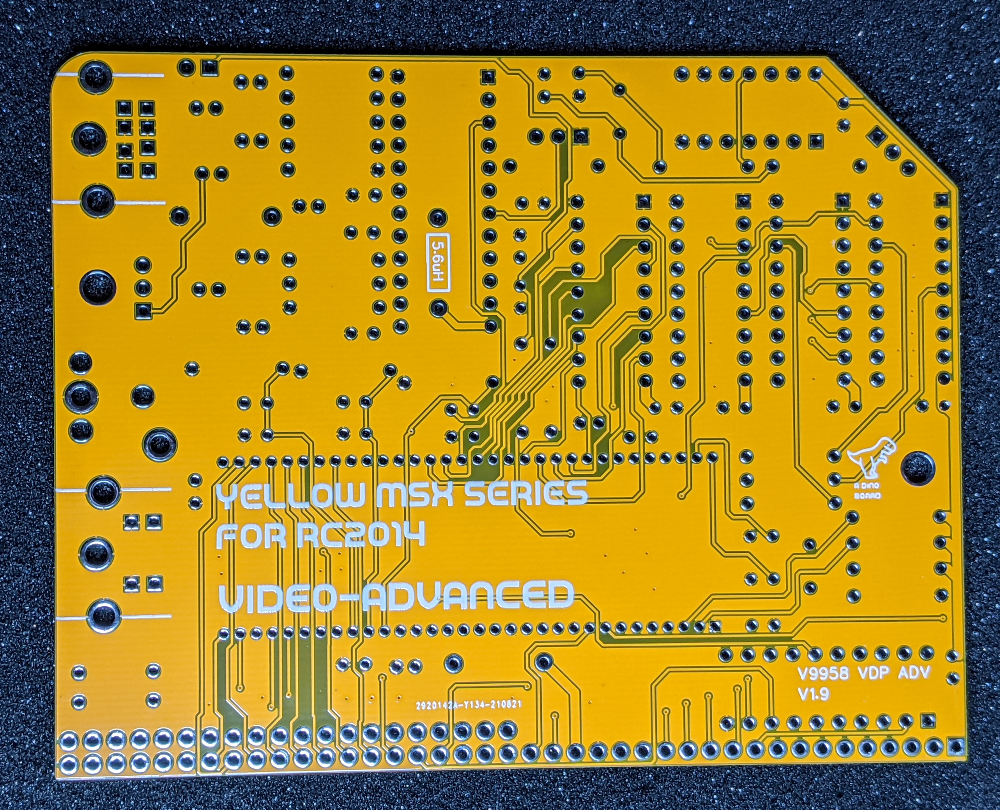

## V9958 Advanced Video Module Designed for RC2014

Hackaday Project: [msx-compatible-boards-for-rc2014](https://hackaday.io/project/175574-msx-compatible-boards-for-rc2014)

### Description

A complete kit to give your RC2014 the advanced graphic capabilities of the mid to late 80s. It's based on the V9958 Video Display Processor (VDP) which powered
the MSX2+ line of 8 bit Z80 computers.

This V9958 chip, was produced by Yamaha in the late 80s and was an update to the their V9938 chip, which was itself, a successor to TI's TMS9918.  The V9938/V9958 addressed many of the shortcomings of the original TMS9918.

### Key features of this module

* Compatible with RC2014 (enhanced bus required)
* 128K of RAM
* RGB, Composite and S-Video output
* Can be built for PAL or NTSC configuration

### Revision 1.9 enhancements

* Addition of noise filtering for both the V9958 and CXA1645P chips
* Compatible with RC2014's operating with Interrupt Mode 2
* Replaced diode-gate chip select circuit with PLD gates - enabling more reliable operation.
* Selectable sync signal for the RGB output (TTL, composite or Luma)

<table>
  <tr><td></td><td></td></tr>
  <tr><td></td><td></td></tr>
  <tr><td colspan=2 style="text-align: center"></td></tr>
</table>

A quick video of it in operation (V1.4): https://youtu.be/cfbAkXvbp94

### RGB mini din pin out

<table>
  <tr>
    <th>Pin</th><th>Signal</th><th/>
  </tr>
  <tr><td>1</td><td>Audio* </td><td rowspan=8></td></tr>
  <tr><td>2</td><td>Audio </td></tr>
  <tr><td>3</td><td>Sync** </td></tr>
  <tr><td>4</td><td>Ground</td></tr>
  <tr><td>5</td><td>NC    </td></tr>
  <tr><td>6</td><td>Blue  </td></tr>
  <tr><td>7</td><td>Green </td></tr>
  <tr><td>8</td><td>Red   </td></tr>

</table>

\* The sync provided is as per the selection of J4A and J4B.

**Its important that only one jumper is applied to J4.**

To select TTL level for sync - apply a jumper to J4A (top right of board)

To select luma as the sync signal - apply the jumper to J4B's top 2 pins.

To select composite as the sync signal - apply the jumper to J4B's bottom 2 pins.

> **Please note that using a TTL level sync signal to device not designed for this level of voltage, may damage the monitor/converter's components.**

### Bill of Materials

|Count   | Name  |
|:------:|-------|
| 1      |  47pF  |
| 16     |   0.1uF |
| 4      |  10uF   |
| 6      |  220uF   |
| 1      |  27pF/18pF  |
| 4      |  22pF  |
| 1      |  5pF  |
| 3      |  330pF  |
| 1      | HDR 1x2 |
| 1      | HDR 1x3 |
| 1      | SHUNT 1x2 |
| 2      |  5.6uH   |
| 1      |  68uH   |
| 1      |  RCA SOCKET  |
| 1      |  RGB-OUT  |
| 1      |  S-VIDEO  |
| 3      |  10K  |
| 6      |  75   |
| 1      |  20K/16K |
| 1      |  47K  |
| 2      |  1K   |
| 4      |  470  |
| 1      |  2k2  |
| 1      |  1M   |
| 4      |  100   |
| 1      |  V9958   |
| 1      |  ATF16V8  |
| 1      |  CXA1645P  |
| 1      |  74HC04  |
| 4      |  41464C  |
| 1      |  21.47727MHz  |
| 1      |  4.433618MHz  |
| 1      | Right Angle 20x2 Header |
| 1      | Right Angle header 1x20 |
| 1      |  14 POS IC SOCKET    |
| 4      |  18 POS IC SOCKET    |
| 1      |  20 POS IC SOCKET    |
| 1      |  24 POS IC SOCKET    |
| 1      |  64 POS IC SOCKET    |

### Output connections

You will want to think about how you plan to connect this board to your chosen monitor.  The video signals produced by 80's hardware is not trivial to connect to modern HDMI LCD monitors.  For such monitors you will need a converter to upscale the output.  Although VGA Monitors can accept a RGB signal, they are unlikely to support the lower frequency of 15Khz produced by these modules.

The advanced module produces 3 output types, Composite, S-Video and RGBs.  The RGBs output is recommended for best results.  The RGBs output is provided via an 8 pin mini-din connector.  You will almost certainly need to make up a cable to connect to an RGB monitor or converter.

The [RetroRGB upscalers article](https://www.retrorgb.com/upscalers.html) has a good description for some of the converter options.

Items such as retroTink and OSSC are very high quality converters - but also have a decent price tag.

I have found the low cost arcade converters such as the GBS-8200 and HD-VC9900 converters produce excellent results.  The upscalers can be acquired through the usual ebay, amazon and other sellers at very reasonable prices.

The GBS-8200 can also be easily modified to produce more customisable and higher quality output - again RetroRGB has it all explained at [GBS Control](https://www.retrorgb.com/gbs-control-installation-overview.html)

If you plan to use the GBS8200 or HD-VC9900 converters, then you probably want to consider the RGB only kit.

## Sample Apps

For a base ROMWBW build you can find compatible demo apps in the [apps-rc2014](../apps-rc2014) directory - they can be run under CP/M on a RC2014 system.  The prebuilt binaries can be found in the [bin](../bin) directory.

For a MSX-DOS system, binaries for various apps and demos can be found in the [github releases](https://github.com/vipoo/yellow-msx-series-for-rc2014/releases)

## Port Mapping

The board uses the standard IO addresses for MSX systems.

The first 2 ports are identical as per the TMS9918 chip.  The V9938/58 have additional ports to access higher functions.

| Port |	Description|
|------|-------------|
| $98	(r/w) | VRAM data  |
| $99 (w)	| VDP register selection |
| $99 (r)	 | Status register |
| $9A |	Palette access  |
| $9B	| Indirect register access  |

## Programming the chip

Have a look at the sample apps included in this repo [apps-rc2014](../apps-rc2014).

For specific details on programming the chip, I recommend:

* [V9938 Programmers Guide](http://rs.gr8bit.ru/Documentation/V9938-programmers-guide.pdf) hosted on (http://www.gr8bit.ru/gr8bit-knowledge-base.html)
* [V9938 Datasheet](../datasheets/yamaha_v9938.pdf)
* [V9958 Datasheet](../datasheets/yamaha_v9958.pdf)

* Also worth checking out some MSX VDP specific articles at: [http://map.grauw.nl/](http://map.grauw.nl/articles/).

## Resources

* Schematic design for Advanced module (revision 1.4): [schematic-video-adv-v1.4.pdf](schematic-video-adv-v1.4.pdf "Schematic design for V9958 board designed for RC2014 (revision 1.4")
* Schematic design for Advanced module (revision 1.9): [schematic-video-adv-v1.9.pdf](schematic-video-adv-v1.9.pdf "Schematic design for V9958 board designed for RC2014 (revision 1.9")

## Construction notes

Please note that due to the finer pitch pins of the V9958, the soldering of this board requires a little more finesse than the typical RC2014 through-hole based boards.  If you have built a few boards already, then you should be fine.  It's recommended that a finer pitch soldering tip be used as it can be easy to accidently bridge some of the pins.

Extra care needed when inserting the V9958 into its socket - there are lots of pins, take your time to avoid bending pins.

For the advanced module, you need to identify if you plan to build a PAL or NTSC version and select the correct resistor and capacitors for R13 and C24.

For the PAL version, R13 must be 16K, C24 18pf.
For the NTSC version, R13 must be 20K and C24 27pf.
J1 and J2 are shorted appropriately.

### Errata for V1.9

The Diodes D1 and D2 are redundant and not required.  Solder a wire where the silkscreen has the diodes layed out (bottom right of pcb).

## License
Copyright 2021 Dean Netherton

Permission is hereby granted, free of charge, to any person obtaining a copy of this software and associated documentation files (the "Software"), to deal in the Software without restriction, including without limitation the rights to use, copy, modify, merge, publish, distribute, sublicense, and/or sell copies of the Software, and to permit persons to whom the Software is furnished to do so, subject to the following conditions:

The above copyright notice and this permission notice shall be included in all copies or substantial portions of the Software.

THE SOFTWARE IS PROVIDED "AS IS", WITHOUT WARRANTY OF ANY KIND, EXPRESS OR IMPLIED, INCLUDING BUT NOT LIMITED TO THE WARRANTIES OF MERCHANTABILITY, FITNESS FOR A PARTICULAR PURPOSE AND NONINFRINGEMENT. IN NO EVENT SHALL THE AUTHORS OR COPYRIGHT HOLDERS BE LIABLE FOR ANY CLAIM, DAMAGES OR OTHER LIABILITY, WHETHER IN AN ACTION OF CONTRACT, TORT OR OTHERWISE, ARISING FROM, OUT OF OR IN CONNECTION WITH THE SOFTWARE OR THE USE OR OTHER DEALINGS IN THE SOFTWARE.

