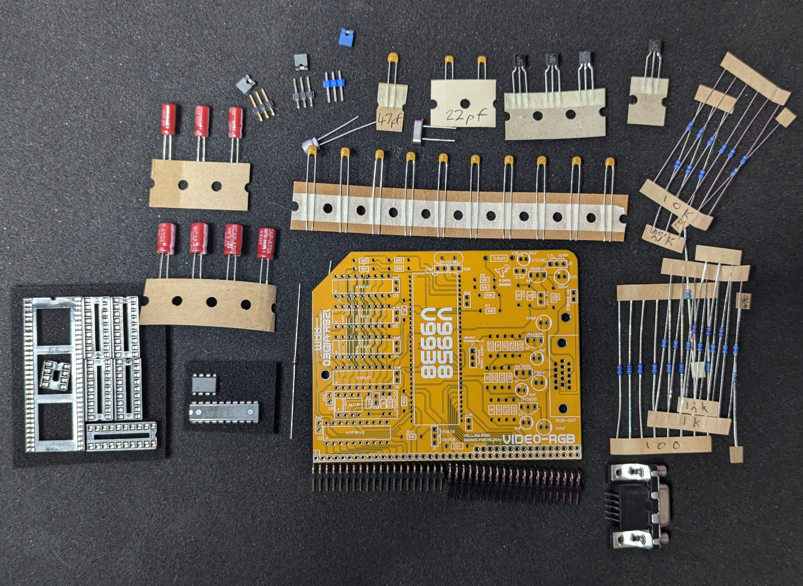
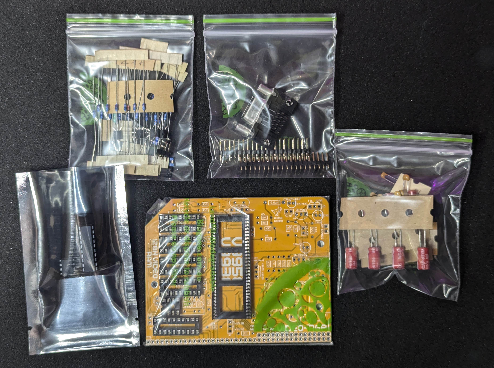
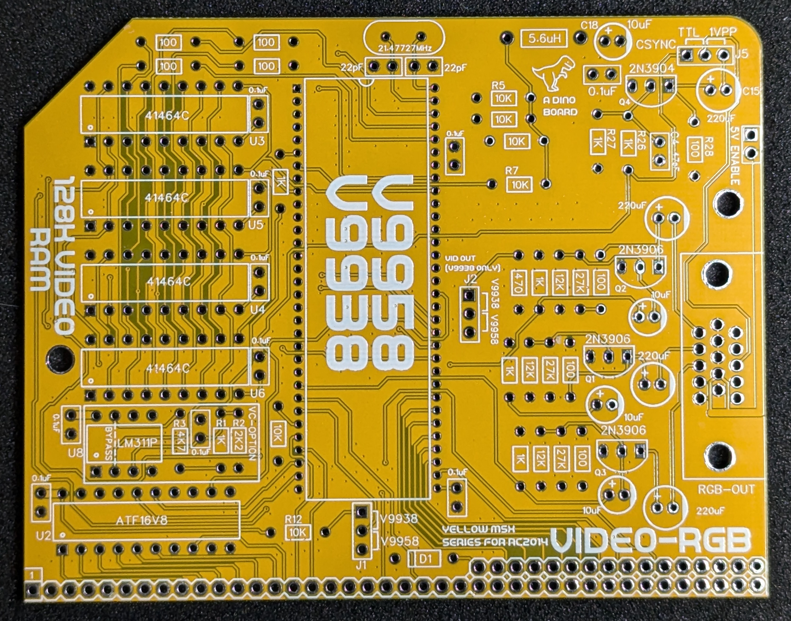
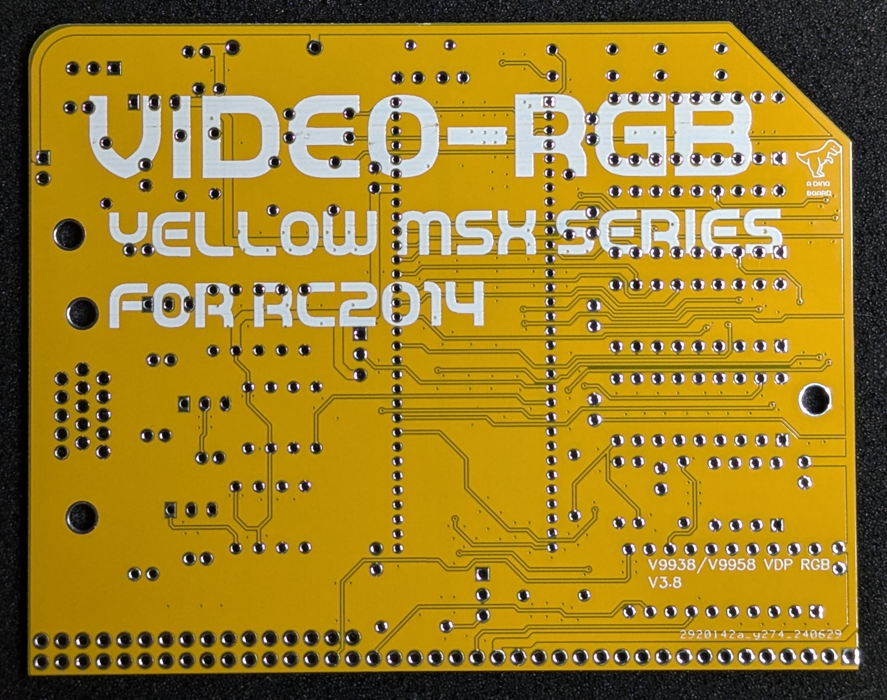
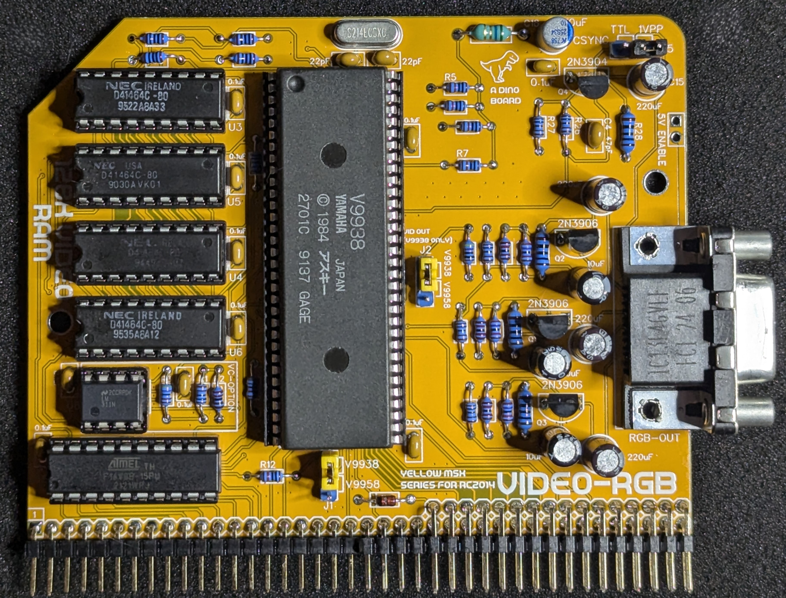

## V99x8 Video Module Designed for RC2014

Hackaday Project: [msx-compatible-boards-for-rc2014](https://hackaday.io/project/175574-msx-compatible-boards-for-rc2014)

### Description

A complete kit to give your RC2014 the advanced graphic capabilities of the mid to late 80s. It based around the V9938 or V9958 Video Display Processor (VDP) which powered the MSX2/MSX2+ line of 8 bit Z80 computers.

The board can be configured to operate the V9938 or the V9958 processors.

This V9958 chip, was produced by Yamaha in the late 80s and was an update to the the V9938 chip, which was itself, a successor to TI's TMS9918.  The V9938/V9958 addressed many of the shortcomings of the original TMS9918.

The V9938 and V9958 are very similar in capability.  See the relevant datasheets below to get some details of the differences.

### Key features of this module

* Compatible with RC2014 (enhanced bus required)
* 128K of RAM
* RGBs via 15-pin DSUB/VGA connector
* Support for either the V9938 or V9958 Video Display Processor

### Key difference with previous revision of this board

* Support for either a V9958 or a V9938 Video Processor
* A LM311 Voltage Comparator for improved CSYNC processing, especially for V9938 chips.

## Images
<table>
  <tr><td style="text-align: center"></td></tr>
</table>

<table>
  <tr>
    <td width="50%"></td>
    <td width="50%"></td>
  </tr>
  <tr>
    <td width="50%"></td>
    <td width="50%"></td>
  </tr>
  <tr>
    <td width="50%"></td>
    <td width="50%"></td>
  </tr>
</table>

### DSUB pin out

<table>
  <tr>
    <th>Pin</th><th>Signal</th>
  </tr>
  <tr><td>1</td><td>Red    </td></tr>
  <tr><td>2</td><td>Green  </td></tr>
  <tr><td>3</td><td>Blue   </td></tr>
  <tr><td>4</td><td>NC     </td></tr>
  <tr><td>5-8, 10-11</td><td>GND     </td></tr>
  <tr><td>9, 12</td><td>NC   </td></tr>
  <tr><td>13</td><td>CSync  </td></tr>
  <tr><td>14,15</td><td>NC    </td></tr>

</table>

### Bill of Materials (Base Kit)

|Count   | Name  |
|:------:|-------|
| 2	     | 22pF |
| 1	     | 47pF |
| 10     | 0.1uF |
| 3      | 10uF   |
| 1	     | 10uF (LOW ESR) |
| 4	     | 220uF |
| 3      | HEADERS 1x3 |
| 3      | SHUNT 1x2 |
| 1      | 5.6uH Inductor   |
| 1      | 1N4148 Diode |
| 1      | 15-PIN DSUB  |
| 3	     | 2N3906 |
| 1	     | 2N3904 |
| 6	     | 10k Ω (3.4mm) |
| 3	     | 12k Ω (3.4mm) |
| 3	     | 27k Ω (3.4mm) |
| 1	     | 4k7 Ω (3.4mm) |
| 1	     | 2k2 Ω (3.4mm) |
| 7	     | 1k Ω (3.4mm) |
| 1	     | 470 Ω (3.4mm) |
| 8	     | 100 Ω (3.4mm) |
| 1	     | LM311N |
| 1	     | ATF16V8 |
| 1      | V9958 or V9938   |
| 4      | 41464C  |
| 1	     | 21.47727MHz |
| 1	     | Right Angle 20x2 Header |
| 1	     | Right Angle 1x20 Header |
| 1	     | 8 POS IC SOCKET |
| 4	     | 18 POS IC SOCKET |
| 1	     | 20 POS IC SOCKET |
| 1	     | 64 POS IC SOCKET |

### Bill of Materials (VDP + RAM)

|Count   | Name  |
|:------:|-------|
| 1	     | V9938 or V9958 VDP |
| 4	     | 41464C RAM |

### Output connections

You will want to think about how you plan to connect this board to your chosen monitor.  The video signals produced by 80's hardware is not trivial to connect to modern LCD monitors.  For such monitors you will need a converter to upscale the output.  Although VGA Monitors can accept a RGB signal, they are unlikely to support the lower frequency of 15Khz produced by these modules.

The RGBs module provides connection via the 15-pin DSUB/VGA connector.  This output is well suited to connect via a VGA cable to a compatible HDMI/VGA up-converter that accepts a RGBs signal over the 15pin connection, such as the GBS-8200 or HD-VC9900 converters.  For more information on the DSUB RGB/VGA see [RetroRGB's VGA article](https://www.retrorgb.com/vgaconnector.html)

The [RetroRGB upscalers article](https://www.retrorgb.com/upscalers.html) has a good description for some of the converter options.

Items such as retroTink and OSSC are very high quality converters - but also have a decent price tag.

I have found the low cost arcade converters such as the GBS-8200 and HD-VC9900 converters produce excellent results.  The upscalers can be acquired through the usual ebay, amazon and other sellers at very reasonable prices.

The GBS-8200 can also be easily modified to produce more customisable and higher quality output - again RetroRGB has it all explained at [GBS Control](https://www.retrorgb.com/gbs-control-installation-overview.html)

### Video Upscaling Testing status

I have tested both V9958 and V9938 versions of the kit with the low cost GBS-8200 and HD-VC9900 upscalers.  These have produced solid stable images for the respective VGA and HDMI output.  They seem very tolerant of CSYNC voltage signal levels.

My recommendation is to use GBS-8200 or the HD-VC9900 upscalers.  The quality is fine and I do most of my testing on these converters.  Just google their codes and you will find the usual retailers/marketplaces (eg: ebay/amazon/aliexpress) have plenty of purchase options.

Other upscalers, such as the OSSC and retroTink may work, but I am unable to verify and confirm.  Your milage may very.  Adapter cables would need to be constructed.

I have **not** tested the unit on a real RGB CRT monitor.

## Sample Apps

For a base ROMWBW build you can find compatible demo apps in the [apps-rc2014](../apps-rc2014) directory - they can be run under CP/M on a RC2014 system.  The prebuilt binaries can be found in the [bin](../bin) directory.

For a MSX-DOS system, binaries for various apps and demos can be found in the [github releases](https://github.com/dinoboards/yellow-msx-series-for-rc2014/releases)

## Port Mapping

The board uses the standard IO addresses for MSX systems.

The first 2 ports are identical as per the TMS9918 chip.  The V9938/58 have additional ports to access higher functions.

| Port |	Description|
|------|-------------|
| $98	(r/w) | VRAM data  |
| $99 (w)	| VDP register selection |
| $99 (r)	 | Status register |
| $9A |	Palette access  |
| $9B	| Indirect register access  |

## Programming the chip

Have a look at the sample apps included in this repo [apps-rc2014](../apps-rc2014).

For specific details on programming the chip, I recommend:

* [V9938 Programmers Guide](http://rs.gr8bit.ru/Documentation/V9938-programmers-guide.pdf) hosted on (http://www.gr8bit.ru/gr8bit-knowledge-base.html)
* [V9938 Datasheet](../datasheets/yamaha_v9938.pdf)
* [V9958 Datasheet](../datasheets/yamaha_v9958.pdf)

* Also worth checking out some MSX VDP specific articles at: [http://map.grauw.nl/](http://map.grauw.nl/articles/).

## Resources

* Schematic (revision 3.8): [schematic-video-rgb-v3.8.pdf](./schematic-video-rgb-v3.8.pdf "Schematic (revision 3.8")

## Construction notes

Please note that due to the finer pitch pins of the V9958, the soldering of this board requires a little more finesse than the typical RC2014 through-hole based boards.  If you have built a few boards already, then you should be fine.  It's recommended that a finer pitch soldering tip be used as it can be easy to accidentally bridge some of the pins.

Extra care needed when inserting the V9958 into its socket - there are lots of pins, take your time to avoid bending pins.

> **Extremely important to ensure the jumpers are in the correction position for your chosen Video Display Processor.  Incorrect selection may result in damage to your video processor.  See the silkscreen for the 2 relevant jumpers.  Short the top 2 pins only for a V9958.  Short the bottom 2 pins only for a V9938.**

## License

Copyright 2024 Dean Netherton

Permission is hereby granted, free of charge, to any person obtaining a copy of this software and associated documentation files (the "Software"), to deal in the Software without restriction, including without limitation the rights to use, copy, modify, merge, publish, distribute, sublicense, and/or sell copies of the Software, and to permit persons to whom the Software is furnished to do so, subject to the following conditions:

The above copyright notice and this permission notice shall be included in all copies or substantial portions of the Software.

THE SOFTWARE IS PROVIDED "AS IS", WITHOUT WARRANTY OF ANY KIND, EXPRESS OR IMPLIED, INCLUDING BUT NOT LIMITED TO THE WARRANTIES OF MERCHANTABILITY, FITNESS FOR A PARTICULAR PURPOSE AND NONINFRINGEMENT. IN NO EVENT SHALL THE AUTHORS OR COPYRIGHT HOLDERS BE LIABLE FOR ANY CLAIM, DAMAGES OR OTHER LIABILITY, WHETHER IN AN ACTION OF CONTRACT, TORT OR OTHERWISE, ARISING FROM, OUT OF OR IN CONNECTION WITH THE SOFTWARE OR THE USE OR OTHER DEALINGS IN THE SOFTWARE.

