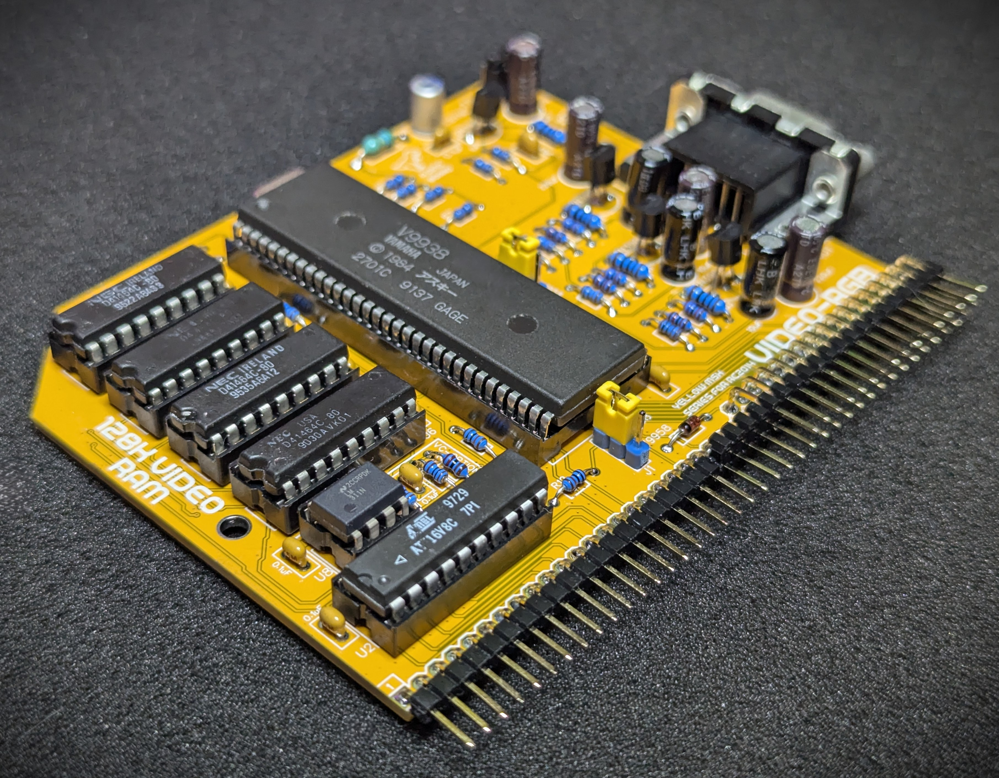
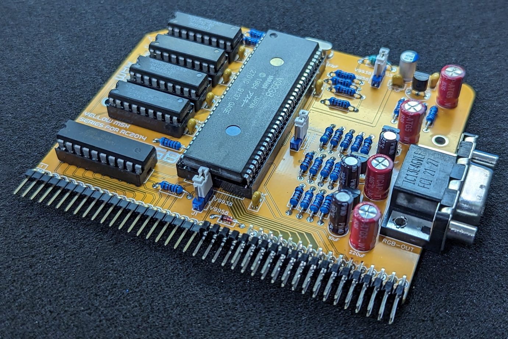
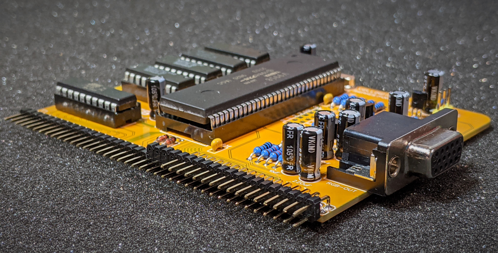

## V9958 Video Module Designed for RC2014

Hackaday Project: [msx-compatible-boards-for-rc2014](https://hackaday.io/project/175574-msx-compatible-boards-for-rc2014)

There have been a few variations of the Video Module.

## V99x8 MSX RGB Module for RC2014 (V3.8)

This kit supports a RGBs output via a standard 15-pin DSUB/VGA connector. A standard VGA cable can be used to plug directly into a compatible device (converter or native 15kHz supported monitor).

It can accommodate a V9938 or the slightly more advanced chip the V9958.

This kit is very similar to version V3.3, but with improved support for the V9938 and the processing of the CSYNC signal improves image stability.

* Kits available at: https://www.tindie.com/products/dinotron/v99x8-msx-rgb-video-module-for-rc2014/

<table>
  <tr><td style="text-align: center"></td></tr>
</table>

[Click here for full Details](./README-RGB.md)

 

 

# Retired Modules

## V99x8 MSX RGB Module for RC2014 (V3.3) (Retired)

This kit supports a RGBs output via a standard 15-pin DSUB/VGA connector. A standard VGA cable can be used to plug directly into a compatible device (converter or native 15kHz supported monitor).

It can accommodate a V9938 or the slightly more advanced chip the V9958.

* Kits available at: https://www.tindie.com/products/dinotron/v99x8-msx-rgb-video-module-for-rc2014/

<table>
  <tr><td style="text-align: left"></td></tr>
</table>

[Click here for full Details](./README-RGB-V3.3.md)

## V9958 MSX RGB Module for RC2014 (V2.2) (Retired)

This kit supports a RGBs output via a standard 15-pin DSUB/VGA connector. A standard VGA cable can be used to plug directly into a compatible device (converter or native 15kHz supported monitor).

It also has pin outs for installing optional headers for various V9958 signals, such as the colour bus, clock and other syncing signals.

* Kits available at: https://www.tindie.com/products/dinotron/v9958-msx-rgb-video-module-for-rc2014/

<table>
  <tr><td style="text-align: left"></td></tr>
</table>

[Click here for full Details](./README-RGB-V2.md)

## V9958 MSX Video Advanced Module for RC2014 (V1.9)

This kit, in addition to producing an RGBs output signal, also provides composite and s-video output.

Due to space restrictions, the RGBs output is via a mini-din connector, thus necessitating a custom cable be made if RGB output is desired.

* Kits available at: https://www.tindie.com/products/dinotron/v9958-msx-video-advanced-module-for-rc2014/

<table>
  <tr><td style="text-align: left"></td></tr>
</table>

[Click here for full Details](./README-ADV.md)

## License
Copyright 2021 Dean Netherton

Permission is hereby granted, free of charge, to any person obtaining a copy of this software and associated documentation files (the "Software"), to deal in the Software without restriction, including without limitation the rights to use, copy, modify, merge, publish, distribute, sublicense, and/or sell copies of the Software, and to permit persons to whom the Software is furnished to do so, subject to the following conditions:

The above copyright notice and this permission notice shall be included in all copies or substantial portions of the Software.

THE SOFTWARE IS PROVIDED "AS IS", WITHOUT WARRANTY OF ANY KIND, EXPRESS OR IMPLIED, INCLUDING BUT NOT LIMITED TO THE WARRANTIES OF MERCHANTABILITY, FITNESS FOR A PARTICULAR PURPOSE AND NONINFRINGEMENT. IN NO EVENT SHALL THE AUTHORS OR COPYRIGHT HOLDERS BE LIABLE FOR ANY CLAIM, DAMAGES OR OTHER LIABILITY, WHETHER IN AN ACTION OF CONTRACT, TORT OR OTHERWISE, ARISING FROM, OUT OF OR IN CONNECTION WITH THE SOFTWARE OR THE USE OR OTHER DEALINGS IN THE SOFTWARE.

